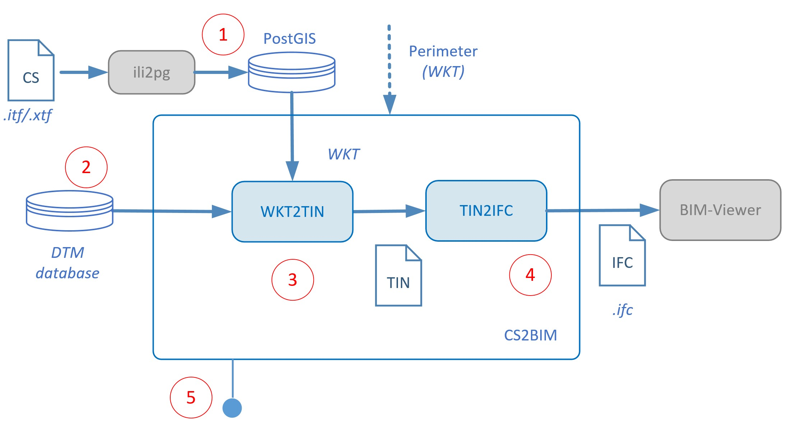
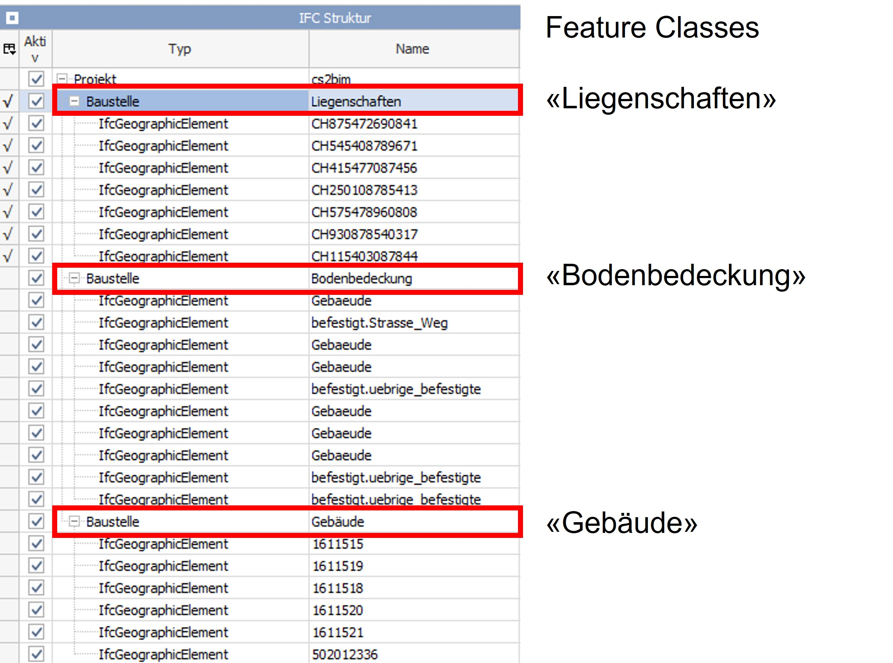

# cs2bim

- [cs2bim](#cs2bim)
- [Project description](#project-description)
    - [Resulting IFC Files](#resulting-ifc-files)
- [Concepts](#concepts)
- [Getting started](#getting-started)
    - [Getting started (Development)](#getting-started-development)
- [Configuration](#configuration)
    - [Configuration parameters (overview)](#configuration-parameters-overview)
    - [IFC configuration](#ifc-configuration)
        - [Geo referencing](#geo-referencing)
        - [Triangulation Representation Type](#triangulation-representation-type)
        - [Feature Types](#feature-types)
            - [SQL](#sql)
            - [Spatial Structure](#spatial-structure)
        - [Groups](#groups)
        - [Example](#example)
- [Known Issues](#known-issues)
- [Contact](#contact)
- [References](#references)

# Project description

The Conference of Cantonal Geoinformation and Cadastral Offices (KGK) has launched a research project *Cadastral
Surveying Data to Building Information Modeling (CS2BIM)*. The _Institute of Virtual Design and Construction_ and the
_Institute of Geomatics_ at the University of Applied Sciences Northwestern Switzerland (FHNW) have developed a service
based on open source libraries. The service transforms GIS-based cadastral survey (CS) data with area geometries (2D) to
IFC instances with 3D surface geometries. The geometry transformation is based on a projection of the 2D geometries onto
the digital terrain model.

The service contains the following major components:

- Importing and processing of INTERLIS data by the ili2pg component and storing in a PostGIS database. The vector data
  is read from [WKT](http://giswiki.org/wiki/Well_Known_Text) format.
- Processing of the terrain model data and creating the resulting 3D surfaces
- Exporting of the objects to IFC format using the IfcOpenShell component

{width=600}

The diagram shows the system architecture and all major components of the implementation. Description of the components:

| component | name                | description                                                                                                                                                                                                                               |
|-----------|---------------------|-------------------------------------------------------------------------------------------------------------------------------------------------------------------------------------------------------------------------------------------|
| 1         | PostGIS database    | The cadastral data is imported from an INTERLIS (.xtf or itf) format via the standard component ili2pg (swisstopo) and made available in a PostGIS database for further processing. The component database is not covered within the code |
| 2         | DTM database        | The digital terrain model (DTM) is loaded with the API service to swissALTI3D data.                                                                                                                                                       |
| 3         | wkt2tin             | Component for creating 3D surfaces by projecting 2D vector objects (usually polygons) onto a terrain model. As a result of this component, mesh surface geometries are available for each object instance (of the cadastral information). |
| 4         | tin2ifc             | This component writes the resulting IFC file. The open library IfcOpenShell is used for this purpose.                                                                                                                                     |
| 5         | API & configuration | This service package combines the individual components with their configuration into a ‘CS2BIM’ service. The service is built in a docker container.                                                                                     |

## Resulting IFC Files

{width=1000}

Example files can be downloaded with the following links.

| ID | name              | link                                                | description                                                                                         |
|----|-------------------|-----------------------------------------------------|-----------------------------------------------------------------------------------------------------|
| 1  | 200mx200m.ifc     | https://drive.switch.ch/index.php/s/YOgygwb3ZqmG44v | All areas (parcel, landcover etc.) that intersect with the 200m x 200m polygon are included         | 
| 2  | 200mx200m_con.ifc | https://drive.switch.ch/index.php/s/2pivcwXtneYqSdY | All areas (parcel, landcover etc.) that are fully contained by the 200m x 200m polygon are included |
| 3  | 200mx200m_int.ifc | https://drive.switch.ch/index.php/s/Us2SHISz1XuMsGf | All areas (parcel, landcover etc.) are cut off at the border of the 200m x 200m polygon             |
| 4  | 500mx500m.ifc     | https://drive.switch.ch/index.php/s/NlH1WwYj6uC5NPc | All areas (parcel, landcover etc.) that intersect with the 500m x 500m polygon are included         | 

# Concepts

The cs2bim service supports different central IFC concepts and allows a relatively dynamic (configurable) transformation
between the geodata and the IFC data model. The main IFC concepts and principles of data transformation and processing
are briefly explained on the [Concepts](docs/concepts.md) page.

# Getting started

Modify the configuration according to your needs/environment. Details about configuration [see below](#configuration).  
Prerequisites:

- The PostGIS database with the cadastral data is available (connection with psychopg is possible)
- The service to get terrain data is available

Build and run docker image

```console
docker-compose up
```

The run parameters are:

- IFC_VERSION: Ifc version of the resulting ifc file (supported versions/values,
  see [IFC version](src/cs2bim/ifc/enum/ifc_version.py)).
- NAME: Name of the resulting ifc file.
- POLYGON: The area in which the data is treated. The polygon must be a valid wkt string in LV95.
- PROJECT_ORIGIN (optional): The project origin in LV95 coordinates "Easting, Northing, Height". If the project origin
  is
  set, all other geometry values in the ifc are calculated relative to the origin.

Example:

```
curl -X 'POST' \
  'http://localhost:8000/generate-model/' \
  -H 'accept: application/json' \
  -H 'Content-Type: application/json' \
  -d '{
  "IFC_VERSION": "IFC4x3_ADD2",
  "NAME": "API Test",
  "POLYGON": "POLYGON((2615490.59 1264657.53, 2615782.92 1264674.74, 2615747.00 1264604.23, 2615490.59 1264657.53))",
  "PROJECT_ORIGIN": "2600000,1200000,0",
  "LANGUAGE": "DE"
}
```

Important: The config file (./config.yml) and the sqls (./sql/) are mounted from starting point (where docker is
started). For the program to work, these files must be provided.

All generated ifc files are stored inside a docker volume called "ifc".
All log files are stored inside a docker volume called "ifc".

## Getting started (Development)

Build and run docker container or build and open a container with your IDE (e.g., VSCode, PyCharm)

```console
docker-compose -f docker-compose-dev.yml up 
```

Install pip packages (Run in container at /workspace)

```console
pip install --no-cache-dir --upgrade -r /workspace/requirements.txt
```

The application can be run in two modes: via the API server or by executing the standalone script with parameters (
main.py).

### API

Run the Celery worker with x concurrent processes:

```console
cd /workspace/src
celery -A worker.app.app worker --concurrency=x
```

Launch the FastAPI development server with hot reload:

```console
cd /workspace/src
python -m uvicorn api.app:app --reload
```

### Standalone script

To run the application locally:

```console
cd /workspace/src
python main.py \
  --IFC_VERSION=<version> \
  --NAME=<name> \
  --POLYGON=<polygon> \
  --PROJECT_ORIGIN=<origin>
  --LANGUAGE=<langugae>
```

# API

This API provides endpoints to generate IFC models based on polygon input, check the generation state, and retrieve the
generated file.
There is also a swagger documentation site documenting all endpoints: http://0.0.0.0:8000/docs

## Endpoints

### 1. `POST /generate-model/`

**Description:** Starts the generation of a new IFC model.

**Request Body (JSON):**

- `IFC_VERSION` *(string, required)*: The IFC version (`IFC4`, `IFC4X3_ADD2`).
- `NAME` *(string, required)*: The name of the model.
- `POLYGON` *(string, required)*: A closed polygon in WKT (Well-Known Text) format.
- `PROJECT_ORIGIN` *(string, optional)*: Origin point as a comma-separated string `[x,y,z]`.
- `LANGUAGE` *(string, optional)*: The language of the model (`DE`, `FR`, `IT`)

**Responses:**

- `200`: Model generation started successfully. Returns task ID.
- `422`: Validation error in the input data.
- `500`: Error.

---

### 2. `GET /generation-state/{task_id}`

**Description:** Retrieves the current state of a model generation task.

**Path Parameter:**

- `task_id` *(string, required)*: The ID of the generation task.

**Responses:**

- `200`: Returns the state of the task.
- `422`: Validation error.
- `500`: Error.

---

### 3. `GET /generated-file/{task_id}`

**Description:** Fetches the generated IFC file once the task is completed.

**Path Parameter:**

- `task_id` *(string, required)*: The ID of the generation task.

**Responses:**

- `200`: Returns the generated file.
- `202`: Task is still ongoing.
- `400`: Model generation failed.
- `410`: File not found.
- `422`: Validation error.
- `500`: Error.

---

# Configuration

Some properties of this application can be configured using the config.yml file.  
You can find the full documentation of the configuration file [here](docs/configuration_schema.md).

## Language Configuration

The language config contains the links to the yaml translation files.
Translations are resolved and written using these yaml files. They are basically a simple key/value table.
The values affected by translation are fixed and not configurable:

- Attribute values
- Property set names
- Property names
- Property values
- Group names

It does not matter whether a value is fixed or retrieved dynamically.
If a translation key cannot be found, the original value is written unchanged.

The following characters are allowed for keys in the table:

- Letters (lowercase)
- Numbers
- Underscore (_)

Keys derived from dynamic values are generated as follows:

1. key = lower_case(key)
2. key = remove_special_characters_except_spaces(key)
3. key = trim_leading_and_trailing_spaces(key)
4. key = replace_sequences_of_spaces_with_single_underscore(key)

Example: "Jahr ( 1990 )" → "jahr ( 1990 )" → "jahr 1990 " → "jahr 1990" → "jahr_1990"

## Redis Configuration

Connection parameters.

## DB Configuration

Connection parameters.

## STAC Configuration

The projection feature types require a DTM file source provided via a STAC API. The building feature types require a
CityGML file source.
These URLs must be defined in the STAC configuration. Both STAC version 0.9 and version 1.0 are supported.

For the configuration to work properly:

- The provided URLs must point to the corresponding STAC collection items
- Each feature/item must include the property: feature.properties.datetime

### DTM

Needs to be set if there are projection feature types configured.
Expected asset properties:

- type = application/x.ascii-xyz+zip
- eo:gsd / gsd = config.tin.grid_size

### Buildings

Needs to be set if there are building feature types configured.
Expected asset properties:

- type = application/x.gml+zip

## TIN Configuration

This configuration sets the grid size and the max height error.

## IFC configuration

In this section of the configuration you can make some general definitions about the resulting ifc file, and you can
define the feature types that are generated and exported as ifc entities.

Below some parameters are explained.

### Geo referencing

You can provide the so-called "Level of Georeferencing" (LoGeoRef), according to (Clemen&Görne, 2019) [^LoGeoRef].  
The different levels represent different methods of defining information about georeferencing in IFC.  
Supported values are:

- LO_GEO_REF_30
    - IfcObjectPlacement of an IfcSpatialStructureElement contains georeferencing
    - Suitability for local projects on a smaller scale
    - IFC 2.3
- LO_GEO_REF_40
    - IfcGeometricRepresentation context of IfcProject contains georeferencing
    - Suited for larger infrastructure projects
    - IFC 2.3
- LO_GEO_REF_50
    - IfcMapConversion defines georeferencing of the "SurveyPoint", including coordinate system parameters
    - Suited for large-scale and linear project expansions
    - IFC 4.0

{width=600}

**Coordinates and Offsets**  
You can provide a project origin in LV95 coordinates (Easting, Northing, Height). The project origin can also be set
to (0,0,0).  
If not provided, the system sets a project origin in the lower left corner on a minimum bounding box of the perimeter.

{width=600}

### Feature types

A "feature type" is the definition of a set of objects that are exported in an IFC entity with common definitions.
Each feature type is defined through a configuration that describes how data from the GIS database is transformed into
IFC entities.
For every configured feature type, a set of instances is created. Currently, two different kinds of feature types are
supported.

{width=300}

#### Projection

Buildings are feature types that are generated by transforming building geometries from a CityGML file into IFC
structures.

##### Projection SQL

A SQL query that selects objects from the GIS database. Each result row is converted into an IFC instance.
The query requires taking a polygon wkt as parameter "%(polygon)s" and must return at least one column named `wkt`,
containing the geometry (as an area).
Additional columns can be included to provide values that can be referenced in the attribute, property, or group
configurations.

The following schema shows the relationship between the attributes defined by the SQL query and their linking to the
configuration.  
{width=600}

Selecting the cadastral data by SQL is flexible and can be done in various ways. There are some examples in the sql
folder:

1. The input polygon
2. All areas (parcel, land cover, etc.) that intersect with the polygon are
   included ([Parcels](./sql/parcels.sql), [Land cover](./sql/land_covers.sql), [Land cover buildings](./sql/land_covers_buildings.sql))
3. All areas (parcel, land cover, etc.) are cut off at the border of the
   polygon ([Parcels intersection](./sql/parcels_intersection.sql), [Land covers intersection](./sql/land_covers_intersection.sql))
4. All areas (parcel, land cover, etc.) that are fully contained by the polygon are
   included ([Parcels contains](./sql/parcels_contains.sql), [Land covers contains](./sql/land_covers_contains.sql))
5. The entire area of the input polygon without subdivisions (polygon.sql)

{width=600}

Useful postgis functions:

ST_GeomFromText → Constructs a PostGIS ST_Geometry object \
ST_AsText → Returns the OGC WKT representation of the geometry\
ST_CurveToLine → Converts a given geometry to a linear geometry\
ST_Intersects → Returns true if two geometries intersect. Geometries intersect if they have any point in common.
ST_Contains → Returns true if the first geometry contains the second.

##### Projection Entity Mapping

Specifies the IFC entity that all selected objects are exported to. It also defines the attributes and properties that
are applied to each exported entity.

##### Entity Type Mapping

Specifies an IFC entity type linked to each created instance. Entity types are shared among other instances of this
feature type if their attribute or property values are identical.

#### Building

Buildings are feature types that are generated by transforming building geometries from a CityGML file.

##### Building SQL

A SQL query that selects objects from the GIS database. Each result row is converted into an IFC instance.
The query requires taking a polygon wkt as parameter "%(polygon)s" and must return at least one column named `egid`,
containing the egid numbers of the buildings laying inside the polygon.
Additional columns can be included to provide values that can be referenced in the attribute, property, or group
configurations.

##### Building Entity Mapping

For building feature types, the associated IFC entity is always IfcBuilding, and this cannot be changed.
The entity mapping defines the attributes, properties, and building parts of the feature type.
Building parts are attached to the corresponding IfcBuilding instance and represent the building’s geometry, allowing
you to define how different parts are mapped and visualized.

#### Spatial Structure Mapping

Specifies the IFC spatial structure element that a created instance is linked to. Spatial structures are shared among
instances if their attribute or property values are identical — even across different feature types. As a result, the
total number of spatial structures ranges from one up to the number of feature type instances.

#### Group Mapping

Defines one or more IFC group assignments. Groups are shared among instances if the grouping attributes or properties
match — even across different feature types.

### Groups

Each feature type instance can be assigned to one or more groups. This configuration is optional—if omitted, no group
assignment will be made. For every group assignment, the system creates an IFC group based on the specified group
configuration,
including its parameters such as entity and any number of attributes or properties. If no configuration exists for a
given assigned value, the system will generate a basic IFC group entity without additional attributes or properties.
When defining groups, the "." character can be used to create nested group structures.

For example, the group "Amtliche Vermessung.Bodenbedeckung.befestigt" results in the creation of three nested groups.
The feature type instances are assigned to the final group in this hierarchy.

- Amtliche Vermessung
    - Bodenbedeckung
        - befestigt
            - Feature type instance 1
            - Feature type instance 2
            - Feature type instance 3
            - ...

### Examples

- [Configuration](./config-min.yml)
- TODO: add examples to other files (SQLs, ...)

# Known Issues

- Potential code optimization is not yet done.Parallelize computational tasks with threads, cache dtm data, load only
  necessary dtm data in memory, process the point cloud only once, and then derive feature type geometries from TIN
  instead of point clouds)
- No support for the ifc classification concept. Could be done the same way as the already implemented group concept.

# Contact

{width=250}

Fachhochschule Nordwestschweiz, Institut Digitales Bauen, 4132 Muttenz \
University of Applied Sciences and Arts Northwestern Switzerland, Institute of Virtual Design and Construction

Project head

- Oliver Schneider
- Prof. Lukas Schildknecht

Project staff

- Prof. Christian Gamma
- Joel Gschwind
- Jonas Meyer

If you use this project for your research, please cite:

```
  @inproceedings{schildknecht2025cs2bim,
    author={Schildknecht, Lukas and Schneider, Oliver and Meyer, Jonas, and Gamma, Christian and Gwschind, Joel},
    title={Integration of land administration data into BIM/IFC - an open source approach for Swiss cadastral survey data},
    year={2025},
    booktitle={Dreiländertagung der DGPF, der OVG und der SGPF in Muttenz, Schweiz},
    series={Publikationen der DGPF},
    volume={Band 33},
    editor={Kersten, Thomas P. and Tilly, Nora},
    publisher={Deutsche Gesellschaft für Photogrammetrie, Fernerkundung und Geoinformation (DGPF) e.V.},
    address={Stuttgart, Germany},
    pages={294--310}
  }
```

# References

[^LoGeoRef]: "Clemen, C., Görne, H., 2019. Level of Georeferencing (LoGeoRef) using IFC for BIM. Journal of Geodesy,
Cartography and Cadastre, 10/2019, S. 15-20. ISSN: 1454-1408" .  