# cs2bim

<!-- TOC -->
* [cs2bim](#cs2bim)
  * [Project description](#project-description)
  * [Further Documentation](#further-documentation)
    * [Concepts](#concepts)
    * [API](#api)
    * [Configuration](#configuration)
  * [Getting started](#getting-started)
  * [Getting started (Development)](#getting-started-development)
    * [API](#api-1)
    * [Standalone script](#standalone-script)
  * [Resulting IFC Files](#resulting-ifc-files)
  * [Known Issues](#known-issues)
  * [Contact](#contact)
  * [References](#references)
<!-- TOC -->

> [!NOTE] 
> See the detailed documentation [here](idibau.github.io/cs2bim/).

## Project description

The Conference of Cantonal Geoinformation and Cadastral Offices (KGK) has launched a research project *Cadastral
Surveying Data to Building Information Modeling (CS2BIM)*. The _Institute of Virtual Design and Construction_ and the
_Institute of Geomatics_ at the University of Applied Sciences Northwestern Switzerland (FHNW) have developed a service
based on open source libraries. The service transforms GIS-based cadastral survey (CS) data with area geometries (2D) to
IFC instances with 3D surface geometries.

The service contains the following major components:

- Importing and processing of INTERLIS data by the ili2pg component and storing in a PostGIS database. The vector data
  is read from [WKT](http://giswiki.org/wiki/Well_Known_Text) format.
- Processing of the terrain model and city gml data to create the resulting 3D surfaces
- Exporting of the objects to IFC format using the IfcOpenShell component
- API Access

To run the service, a ready-to-use Docker-based setup is provided. It includes three independent containers: one for the
API service, another for the Celery worker that executes model generation tasks in the background, and a Redis container
that acts as the message broker, managing task communication between Celery producers and workers. Both the API and
Celery containers contain a copy of the code but use different entry points. Configuration files can be mounted through
predefined folders, and all service outputs are stored in Docker-managed volumes.


## Further Documentation

### Concepts

The cs2bim service supports different central IFC concepts and allows a relatively dynamic (configurable) transformation
between the geodata and the IFC data model. The main IFC concepts and principles of data transformation and processing
are briefly explained on the [Concepts](docs/concepts.md) page.

### API

The cs2bim service provides an API for interaction with its core functionalities. Detailed information about
available endpoints, parameters, and usage examples can be found in the [API documentation](docs/api.md).

### Configuration

The configuration of the cs2bim service is described in two documents: an [overview](docs/configuration.md) explaining
the general setup and structure, and a detailed [configuration schema](docs/configuration_schema.md) explaining all
technical parameters and options.

To generate the document "configuration schema" do the following:

Generate json schema:

```
with open("configuration.json", "w") as stream:
    json.dump(Configuration.model_json_schema(), stream, indent=4)
```

Generate markdown with [jsonschema-markdown](https://pypi.org/project/jsonschema-markdown/):

```
jsonschema-markdown configuration.json > configuration_schema.md --no-empty-columns
```

## Getting started

Modify the configuration according to your needs/environment. Details about configuration [see here](#configuration).  
Prerequisites:

- The PostGIS database with the cadastral data is available (connection with psychopg is possible)
- The service to get external data is available

Build and run docker image

```console
docker-compose up
```

The run parameters are:

- IFC_VERSION: Ifc version of the resulting ifc file (supported versions/values,
  see [IFC version](./src/core/ifc/model/ifc_version.py)).
- NAME: Name of the resulting ifc file.
- POLYGON: The area in which the data is treated. The polygon must be a valid wkt string in LV95.
- PROJECT_ORIGIN (optional): The project origin in LV95 coordinates "Easting, Northing, Height". If the project origin
  is set, all other geometry values in the ifc are calculated relative to the origin.
- LANGUAGE (optional): The language into which the model should be translated (supported values,
  see [Language](./src/i18n/language.py)).

Example:

```console

curl -X 'POST' \
  'http://localhost:8000/generate-model/' \
  -H 'accept: application/json' \
  -H 'Content-Type: application/json' \
  -d '{
  "IFC_VERSION": "IFC4X3_ADD2",
  "NAME": "API Test",
  "POLYGON": "POLYGON((2615490.59 1264657.53, 2615782.92 1264674.74, 2615747.00 1264604.23, 2615490.59 1264657.53))",
  "PROJECT_ORIGIN": "2600000,1200000,0",
  "LANGUAGE": "DE"
}
```

Important: The config file (./config.yml) and the sqls (./sql/) are mounted from starting point (where docker is
started). For the program to work, these files must be provided.

All generated ifc files are stored inside a docker volume called "ifc".
All log files are stored inside a docker volume called "logs".
All fetched data is stored inside a docker volume called "cache". Every file has time to live of 1 day. Redis
is used to keep track of the cached files.

## Getting started (Development)

Build and run docker container or build and open a container with your IDE (e.g., VSCode, PyCharm)

```console
docker-compose -f docker-compose-dev.yml up 
```

Install pip packages (Run in container at /workspace)

```console
pip install --no-cache-dir --upgrade -r /workspace/requirements.txt
```

The application can be executed in two modes: via the API server or by using the standalone script with parameters.

### API

Run the Celery worker with x concurrent processes:

```console
cd /workspace/src
celery -A worker.app.app worker --concurrency=x
```

Launch the FastAPI development server with hot reload:

```console
cd /workspace/src
python -m uvicorn api.app:app --reload
```

### Standalone script

To run the application locally:

```console
cd /workspace/src
python main.py \
  --IFC_VERSION=<version> \
  --NAME=<name> \
  --POLYGON=<polygon> \
  --PROJECT_ORIGIN=<origin>
  --LANGUAGE=<langugae>
```

## Resulting IFC Files

Based on this polygon `POLYGON((2615655 1263023,2616195 1263023,2616195 1262520,2615655 1262520,2615655 1263023))`,
three representative models have been generated. There are three example files provided, illustrating the variety of IFC
configuration possibilities. The configurations and models are available as download. Additionally, a separate ZIP
archive is available, containing supplementary examples on georeferencing and project origin.

| Description        | Spatial structure                           | Groups                                          | 3D                                       | 2D                                          | Configuration                                                   |
|--------------------|---------------------------------------------|-------------------------------------------------|------------------------------------------|---------------------------------------------|-----------------------------------------------------------------|
| Buildings          | 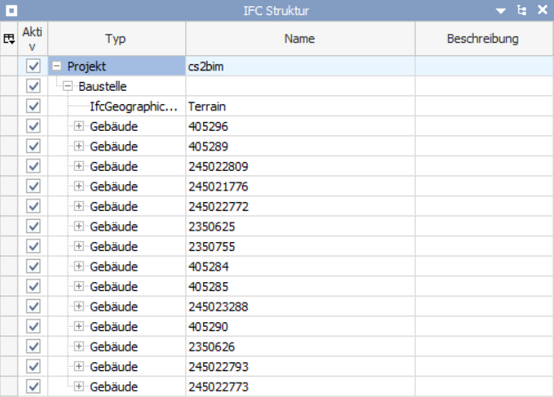 | 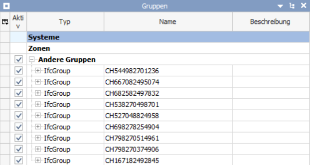 | 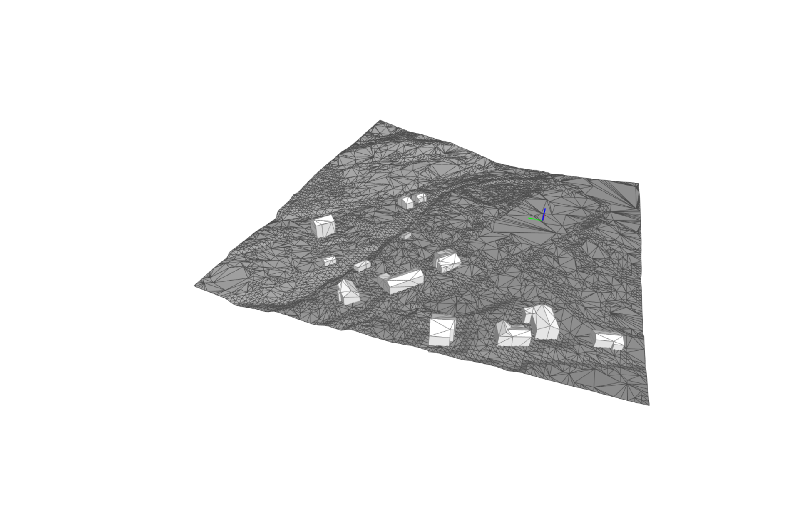 | 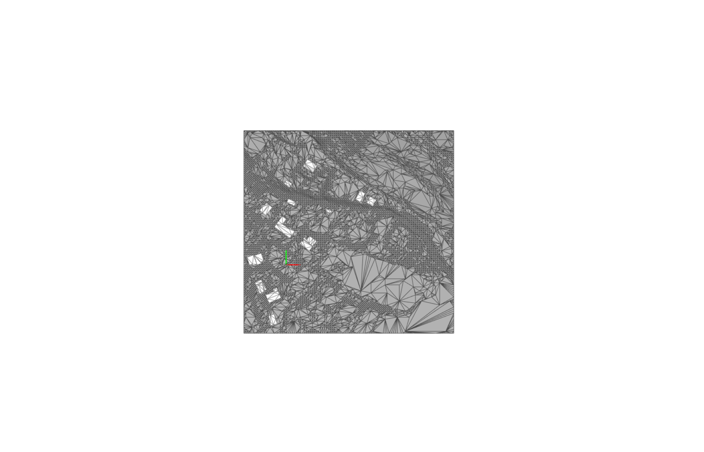 | [Download](https://drive.switch.ch/index.php/s/4sVioXIq7vUIcz5) |
| Land covers        | 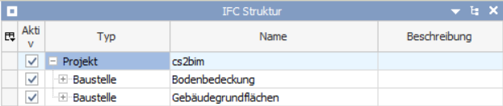 | 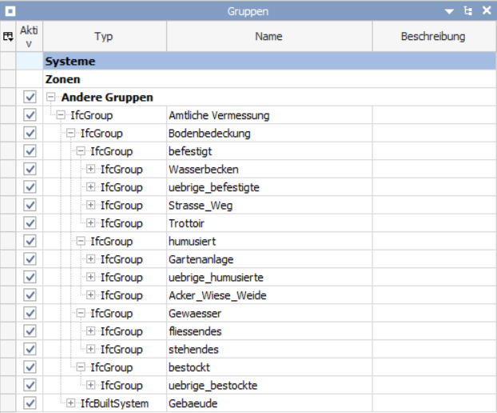 | 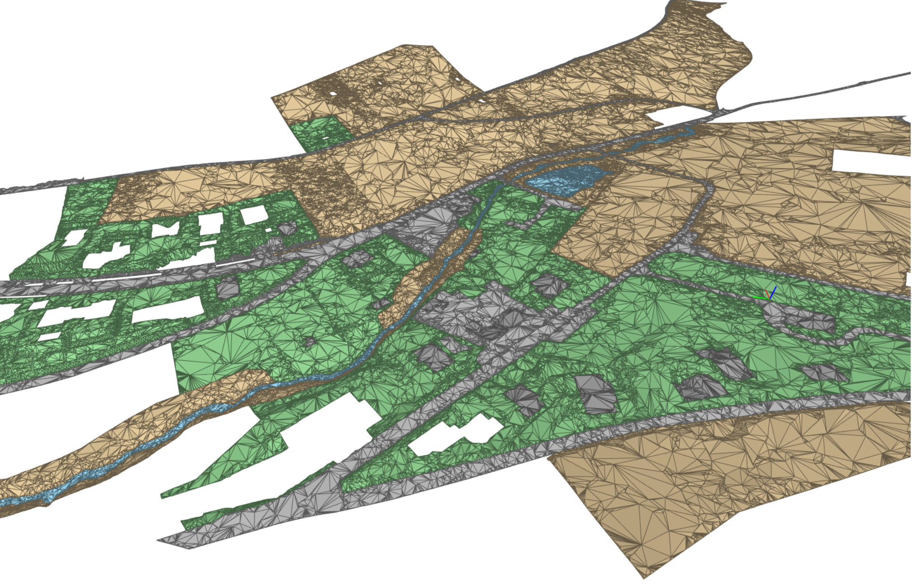 | 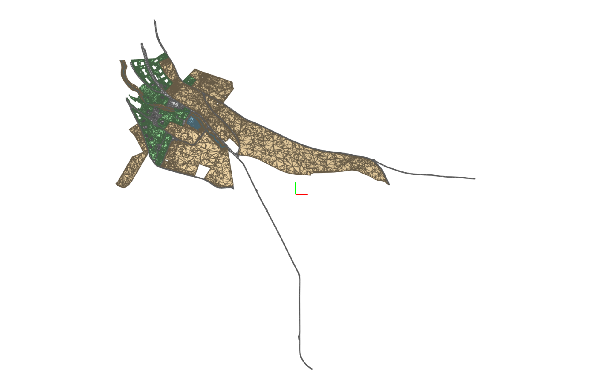 | [Download](https://drive.switch.ch/index.php/s/1mQqXoQaFoN6ZlB) |
| Buildings, Parcels | 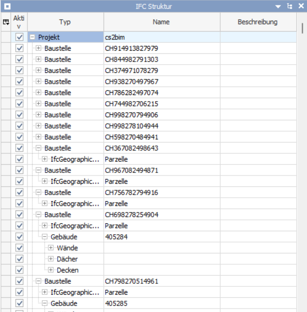 | 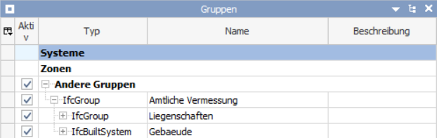 | 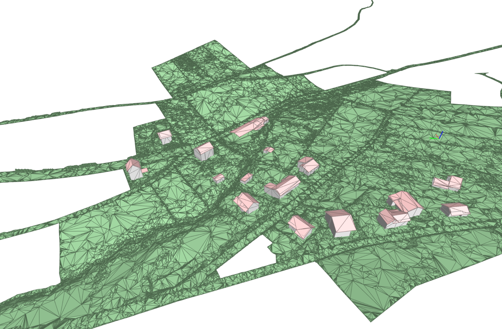 | 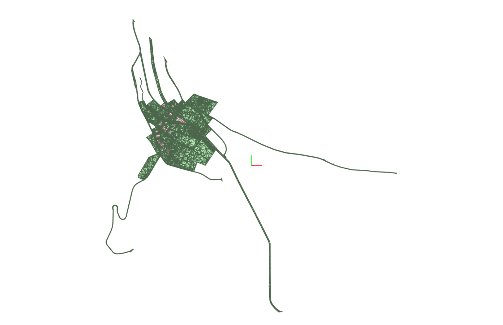 | [Download](https://drive.switch.ch/index.php/s/g3lh4aHA7gyTJzs) |

[Download ifc_supplementary_examples.zip](https://drive.switch.ch/index.php/s/qoe0NF9U77aTw2O)

## Known Issues

- No support for the ifc classification concept. Could be done the same way as the already implemented group concept.

## Contact


Fachhochschule Nordwestschweiz, Institut Digitales Bauen, 4132 Muttenz \
University of Applied Sciences and Arts Northwestern Switzerland, Institute of Virtual Design and Construction

Project head

- Prof. Oliver Schneider
- Prof. Lukas Schildknecht

Project staff

- Prof. Christian Gamma
- Joel Gschwind
- Jonas Meyer

If you use this project for your research, please cite:

```
  @inproceedings{schildknecht2025cs2bim,
    author={Schildknecht, Lukas and Schneider, Oliver and Meyer, Jonas, and Gamma, Christian and Gwschind, Joel},
    title={Integration of land administration data into BIM/IFC - an open source approach for Swiss cadastral survey data},
    year={2025},
    booktitle={Dreiländertagung der DGPF, der OVG und der SGPF in Muttenz, Schweiz},
    series={Publikationen der DGPF},
    volume={Band 33},
    editor={Kersten, Thomas P. and Tilly, Nora},
    publisher={Deutsche Gesellschaft für Photogrammetrie, Fernerkundung und Geoinformation (DGPF) e.V.},
    address={Stuttgart, Germany},
    pages={294--310}
  }
```

## References

[^LoGeoRef]: "Clemen, C., Görne, H., 2019. Level of Georeferencing (LoGeoRef) using IFC for BIM. Journal of Geodesy,
Cartography and Cadastre, 10/2019, S. 15-20. ISSN: 1454-1408" .  