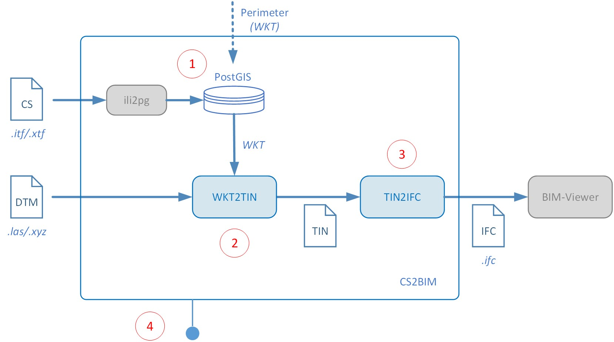
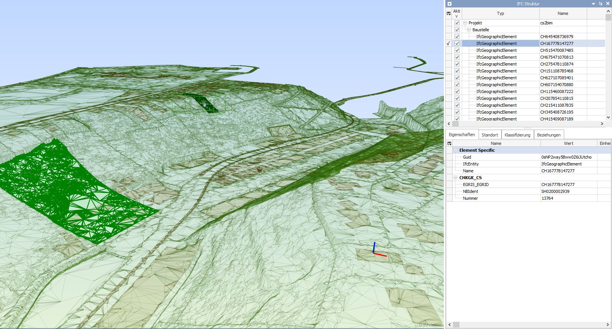
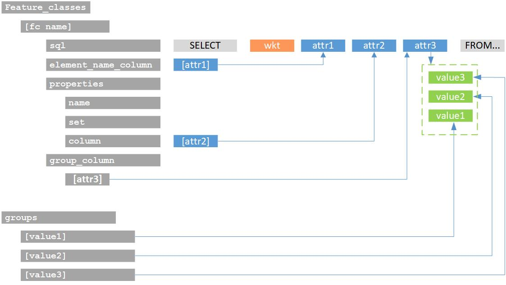

# cs2bim

- [Project description](#project-description)
  - [Resulting IFC Files](#resulting-ifc-files)
- [Concepts](#concepts)
- [Getting started](#getting-started)
  - [Getting started dev](#getting-started-dev)
- [Configuration](#configuration)
  - [Configuration parameters (overview)](#configuration-parameters-(overview))
  - [Types](#types)
  - [IFC configuration](#ifc-configuration)
    - [Geo referencing](#geo-referencing)
    - [Triangulation Representation Type](#triangulation-representation-type)
    - [Feature Classes](#feature-classes)
    - [SQL](#sql)
    - [Spatial Structure](#spatial-structure)
    - [Groups](#groups)
    - [Example](#example)
- [Known Issues](#known-issues)
- [References](#references)

# Project description

The Conference of Cantonal Geoinformation and Cadastral Offices (KGK) has launched a research project *Cadastral Surveying Data to Building Information Modelling (CS2BIM)*. The _Institute of Virtual Design and Construction_ and the _Institute of Geomatics_ at the University of Applied Sciences Northwestern Switzerland (FHNW) have developed a service based on open source libraries. The service transforms GIS based cadastral survey (CS) data with area geometries (2D) to IFC instances with 3D surface geometries. The geometry transformation is based on a projection of the 2D geometries onto the digital terrain model. 

The service contains the following major components:
- Importing and processing of Interlis data by the ili2pg component and storing in a PostGIS database. The vector data is read from [WKT](http://giswiki.org/wiki/Well_Known_Text) format.
- Processing of the terrain model data and creating the resulting 3D surfaces
- Exporting of the objects to IFC format using the IfcOpenShell component

{width=600}

The diagram shows the system architecture and all major components of the implementation. Description of the components:
| component | name | description |
| ------ |----- | ------ |
|   1     | PostGIS database |   The cadastral data is imported from INTERLIS (.xtf or itf) format via the standard component ili2pg (swisstopo) and made available in a PostGIS database for further processing. The component database is not covered within the code   |
|   2     | DTM database | The digital terrain model (DTM) is loaded with the API service to swissALTI3D data. |
|   3     | wkt2tin | Component for creating 3D surfaces by projecting 2D vector objects (usually polygons) onto a terrain model. As a result of this component, mesh surface geometries are available for each object instance (of the cadastral information).      | 
|   4     | tin2ifc | This component writes the resulting IFC file. The open library IfcOpenShell is used for this purpose. |
|   5     |  API & configuration   | This service package combines the individual components with their configuration into a ‘CS2BIM’ service. The service is built in a docker container. |

## Resulting IFC Files

{width=1000}

Example files can be downloaded with the following links.

- [ ] add some description to understand what's the difference between .ifc, _con.ifc, _int.ifc

| ID | name | link |
| ------ | ------ | ----- |
|  1  |    200mx200m.ifc    |   https://drive.switch.ch/index.php/s/YOgygwb3ZqmG44v   |
|  2  |    200mx200m_con.ifc   | https://drive.switch.ch/index.php/s/2pivcwXtneYqSdY |
|  3  |    200mx200m_int.ifc    |  https://drive.switch.ch/index.php/s/Us2SHISz1XuMsGf  |
|  4  |    500mx500m.ifc   |   https://drive.switch.ch/index.php/s/Bcq40YjOljKZ2oa |

# Concepts
The cs2bim service supports different central IFC concepts and allows a relatively dynamic (configurable) transformation between the geodata and the IFC data model. The main IFC concepts and principles of data transformation and processing are briefly explained on the [Concepts](concepts.md) page.


# Getting started

Modify the configuration according to your needs/environment. Details about configuration [see below](#configuration).  
Prerequisites: 
- The PostGIS database with the cadastral data is available (connection with psychopg is possible)
- The service to get terrain data is available

Build docker image
```console
docker build -t cs2bim-run -f Dockerfile . --rm
```

Run docker image
```console
docker run -e IFC_VERSION=[enum.ifc_version.IfcVersion] -e NAME=[str] -e POLYGON=[wkt] -e PROJECT_ORIGIN=[float,float,float] -v .:/workspace/output --name cs2bim-run --rm cs2bim-run
```
The run parameters are:
- IFC_VERSION: Ifc version of the resulting ifc file (supported versions/values see src\cs2bim\ifc\enum\ifc_version.py).
- NAME: Name of the resulting ifc file.
- POLYGON : The area in which the data is treated. The polygon must be a valid wkt string in LV95.
- PROJECT_ORIGIN (optional) : The project origin in LV95 coordinates "Easting,Northing,Height"

- [ ] if project origin is set, are all other geometry values in the ifc calculated relative to the origin? i.e. the heigh in this example will be absolute, but the first point of the polygon would be 89114 instead of 2689114?

Example:
- docker run -e IFC_VERSION="IFC4" -e NAME="Test" -e POLYGON="POLYGON((2689114 1285136,2689143 1285192,2689170 1285159,2689114 1285136))" -e PROJECT_ORIGIN=2600000,1200000,0 -v .:/workspace/output --name cs2bim-run --rm cs2bim-run

After you run the docker container successfully there will be a new output ifc file inside the folder from where you started the container.

Important: If you change the config.yml, the container must be rebuilt to make it work.

## Getting started dev

- [ ] should this be setting up the def environent? 

Build and run docker container or build and open container with your IDE (e.g. VSCode)
```console
docker-compose -f docker-compose-dev.yml up 
```
Install pip packages (Run in container at /workspace)
```console
pip install --no-cache-dir --upgrade -r /workspace/requirements.txt
```

# Configuration
Some properties of this python project can be configured using the config.yml file.  
The configuration has different sections/topics:
- postgis configuration: Connection to the database with the cadastral data.
- DTM configuration: Connection to the service that provides terrain data.
- tin configuration: Configurations for the creation and treatment of tins.
- ifc configuration: Configurations of the resulting ifc file.

- [ ] - as it should be possible to use different terrain data models, keep this generic (DTM configuration), so that a canton could connect their own model if they so wish

## Configuration parameters (overview)

| Line Number | Key | Type | Values | Example |
|---|---|---|---|---|
|0|logging_level|str|NOTSET; DEBUG; INFO; WARN; ERROR; CRITICAL|"cs2bim"|
|---|---|---|---|---|
|1|db.dbname|str|?|"cs2bim"|
|2|db.user|str|?|"postgres"|
|3|db.host|str|?|"host.docker.internal"|
|4|db.port|int|?|5432|
|5|db.password|str|?|"xxx"|
|6|db.schema|str|?|"cs2bim"|
|---|---|---|---|---|
|7|dtm.stac_api|str|?|"https://data.geo.admin.ch/api/stac/v0.9/collections/ch.swisstopo.swissalti3d/items"|
|---|---|---|---|---|
|8|tin.grid_size|float|0.5;2|0.5|
|9|tin.max_height_error|float|TODO|0.05|
|---|---|---|---|---|
|10|ifc.author|str|?|"author"|
|11|ifc.version|str|?|"1.0"|
|12|ifc.application_name|str|?|"cs2bim"|
|13|ifc.project_name|str|?|"Project A"|
|14|ifc.geo_referencing|GeoReferencing|LO_GEO_REF_30; LO_GEO_REF_40; LO_GEO_REF_50|LO_GEO_REF_30|
|15|ifc.triangulation_representation_type|TriangulationRepresentationType|TESSELLATION; BREP|BREP|
|16|ifc.feature_classes|map|---|---|
|17|ifc.feature_classes.<em>FeatureClassKeyX</em>.sql|str|<em>Path to sql file</em>|"sql/parcels.sql"|
|18|ifc.feature_classes.<em>FeatureClassKeyX</em>.entity_type|ElementEntityType|IFC_GEOGRAPHIC_ELEMENT|IFC_GEOGRAPHIC_ELEMENT|
|19|ifc.feature_classes.<em>FeatureClassKeyX</em>.attributes|list|---|---|
|20|ifc.feature_classes.<em>FeatureClassKeyX</em>.attributes.<em>ListElementX</em>.attribute|str|?|"Name"|
|21|ifc.feature_classes.<em>FeatureClassKeyX</em>.attributes.<em>ListElementX</em>.column|str|?|"egris_egrid"|
|22|ifc.feature_classes.<em>FeatureClassKeyX</em>.properties|list|---|---|
|23|ifc.feature_classes.<em>FeatureClassKeyX</em>.properties.<em>ListElementX</em>.name|str|?|"Property"|
|24|ifc.feature_classes.<em>FeatureClassKeyX</em>.properties.<em>ListElementX</em>.set|str|?|"PropertySet"|
|25|ifc.feature_classes.<em>FeatureClassKeyX</em>.properties.<em>ListElementX</em>.column|str|?|"property_column"|
|26|ifc.feature_classes.<em>FeatureClassKeyX</em>.spatial_structure.entity_type|SpatialStructureEntityType|IFC_SITE|IFC_SITE|
|27|ifc.feature_classes.<em>FeatureClassKeyX</em>.spatial_structure.attributes|list|---|---|
|28|ifc.feature_classes.<em>FeatureClassKeyX</em>.spatial_structure.attributes.<em>ListElementX</em>.attribute|str|?|"Name"|
|29|ifc.feature_classes.<em>FeatureClassKeyX</em>.spatial_structure.attributes.<em>ListElementX</em>.value|str|?|"Site"|
|30|ifc.feature_classes.<em>FeatureClassKeyX</em>.group_columns|list[str]|?|"group_column"|
|31|ifc.feature_classes.<em>FeatureClassKeyX</em>.color_definition.r|float|0.0 - 1-0|0.1|
|32|ifc.feature_classes.<em>FeatureClassKeyX</em>.color_definition.g|float|0.0 - 1-0|0.5|
|33|ifc.feature_classes.<em>FeatureClassKeyX</em>.color_definition.b|float|0.0 - 1-0|0.5|
|34|ifc.feature_classes.<em>FeatureClassKeyX</em>.color_definition.a|float|0.0 - 1-0|0.3|
|35|ifc.feature_classes.<em>FeatureClassKeyX</em>.groups|map|---|---|
|36|ifc.feature_classes.<em>FeatureClassKeyX</em>.groups.<em>IfcGroupKeyX</em>.entity_type|GroupEntityType|IFC_DISTRIBUTION_SYSTEM, IFC_DISTRIBUTION_CIRCUIT, IFC_BUILDING_SYSTEM, IFC_STRUCTURAL_ANALYSIS_MODEL, IFC_ZONE|IFC_DISTRIBUTION_SYSTEM|
|37|ifc.feature_classes.<em>FeatureClassKeyX</em>.groups.<em>IfcGroupKeyX</em>.attributes|list|---|---|
|38|ifc.feature_classes.<em>FeatureClassKeyX</em>.groups.<em>IfcGroupKeyX</em>.attributes.<em>ListElementX</em>.attribute|str|?|"Name"|
|39|ifc.feature_classes.<em>FeatureClassKeyX</em>.groups.<em>IfcGroupKeyX</em>.attributes.<em>ListElementX</em>.value|str|?|"Group"|

- [ ] don't use ? if no value list is defined
- [ ] what's up with the TODO?
- [ ] how to read 0.0 - 1-0 ? is that supposed to be '0.0 - 1.0'?
- [ ] are the Types the ifc enumerations?

## Types
Some parameters can only be configured with predefined values (types), because these values are referenced in the code. To guarantee a proper configuration and execution of the code, these predefined values (types) are defined as constants in different modules/classes in the python code.

The following types are defined:
- GeoReferencing -> cs2bim.ifc.enum.geo_referencing.py\
- TriangulationRepresentationType -> cs2bim.ifc.enum.triangulation_representation_type.py\
- ElementEntityType -> cs2bim.ifc.enum.element_entity_type.py\
- SpatialStructureEntityType -> cs2bim.ifc.enum.spatial_structure_entity_type.py\
- GroupEntityType -> cs2bim.ifc.enum.group_entity_type.py

## IFC configuration
In this section of the configuration you can make some general definitions about the resulting ifc file and you can define the feature classes that are generated and exported as ifc entities.  

Below some of the parameters are explained.

### Geo referencing
You can provide the so called "Level of Georeferencing" (LoGeoRef), according to (Clemen&Görne, 2019) [^LoGeoRef].  
The different levels represent different methods of defining informations about georeferencing in IFC.  
Supported values are LO_GEO_REF_30, LO_GEO_REF_40, LO_GEO_REF_50.

{width=400}

- [ ] what's a sensible value here?

**Coordinates and Offets**  
You can provide a project origin in LV95 coordinates (Easting, Northing, Height). The project origin can also be set to (0,0,0).  
If not provided, the system sets a project origin calculated on a minimum bounding box of the perimeter.  


### Triangulation Representation Type
You can define the IFC geometry type that is used to represent the TIN geometry.  
Supported values are TESSELLATION or BREP. TESSELATION is recommended because **it is faster/more accurate/more awesome/...**.

### Feature Classes
A "Feature Class" is the definition of a set of objects that are exported in an IFC entity with common definitions.  
The main configurations of a feature class include:
- sql: A SQL query that selects objects in the GIS database, returning a geometry (must be an area) and some other attributes for each object.
- entity_type: The IFC entity, to which all selected objects of the feature class are exported to.
- attributes: All attributes that are set on the objects.
- properties: Any number of property definitions that are exported as IFC properties/property sets.
- group_columns: Any number of IFC group assignments.
- spatial_structure: The IFC spatial structure, to which all objects of the feature class are appended.
- colour_definition: An IFC colour definition

- [ ] where/how is the feature class used? Is this something that is used in the code to group things? 

### SQL
For each feature class you have to provide a sql query (?) for querying the data(17). With the query you are selecting the cadastral data (with area geometry type). The sql query requires to take a polygon wkt as parameter "%(polygon)s" and return a column named "wkt" with wkt string values. To guarantee correct processing it is important to check that the sql also delivers all columns that are additionally configured for the according feature class. This can be multiple columns for attributes(21), properties(25) or groups(30).

The following schema shows the relationship between the attributes defined by the sql query and their linking to the configuration.  
{width=600}

- [ ] what are the numbers? e.g. data(17)?
- [ ] in the image: is that [fc name] or [ifc name] ?

### Spatial Structure
All objects of a feature class are assigned to one common spatial structure. The spatial structure instance can be configured with its entity type and attributes.

If the specification of the spatial structure instance in different feature class definitions is identical, then only one spatial structure instance is created (and all objects of the feature classes are assigned to the same spatial structure).

- [ ] this is not shown in the image above?
- [ ] Buildings as IFC_BUILDING_SYSTEM, not as building?
- [ ] what if I don't want to group at all?

### Groups
Every exported object can be assigned to a group (zero to multiple). The assignment is defined by an attribute value (of the sql query). For each attribute value, that is used as a group assignment, there should be a group configuration.  
For each group configuration the system is creating an ifc group according to the configured parameters (entity_type and any number of attributes).  
When there is no group configuration for an assigned value, the system will create a simple ifc group entity without any special attributes.

When defining a group you can use "." to create nested group structures. (IfcGroupKey)\
By default all IfcGroups are generated using the IfcGroup entity type. Defining other types of groups can be done by creating a new group config referencing the IfcGroupKey in the configuration file(32).

### Example
config.yml
```yaml
...
  author: "FHNW"
  version: "1.0"
  application_name: "cs2bim"
  project_name: "cs2bim"
  geo_referencing: LO_GEO_REF_30
  triangulation_representation_type: TESSELLATION
  feature_classes:
    parcel:
      sql: "sql/parcels.sql"
      entity_type: IFC_GEOGRAPHIC_ELEMENT
      attributes:
        - attribute: "PredefinedType"
          column: "predefined_type"
      properties:
        - name: "NBIdent"
          set: "CHKGK_CS"
          column: "nbident"
      spatial_structure:
        entity_type: IFC_SITE
        attributes:
        - attribute: "CompositionType"
          value: "COMPLEX"
      group_columns:
        - "group"
      color_definition:
        r: 0.31
        g: 0.67
        b: 0.04
        a: 0.85
  groups:
    Amtliche Vermessung.Gebaeude:
      entity_type: IFC_BUILDING_SYSTEM
      attributes:
        - attribute: "PredefinedType"
          value: "USERDEFINED"
...
```
sql/feature_class_x.sql
```sql
with perimeter as (
    select
        ST_GeomFromText(%(polygon)s, 2056) as geom
)
select
    ST_AsText(ST_CurveToLine(geometrie, 1)) as wkt,
    nbident as name_column,
    nummer as property_column,
    CASE 
        WHEN x THEN 'Amtliche Vermessung.Feature-Klassen.x' 
        ELSE 'Amtliche Vermessung.Feature-Klassen.y'
    END as group
from
    cs2bim.liegenschaft l
    left join cs2bim.grundstueck g on (l.liegenschaft_von = g.t_id)
    join perimeter on ST_Intersects(geometrie, perimeter.geom)
```

Useful postgis functions:

ST_GeomFromText -> Constructs a PostGIS ST_Geometry object \
ST_AsText -> Returns the OGC WKT representation of the geometry\
ST_CurveToLine ->  Converts a given geometry to a linear geometry\
ST_Intersects -> Returns true if two geometries intersect. Geometries intersect if they have any point in common.
ST_Contains -> Returns true if the first geometry contains the second.

# Known Issues
- Only one supported geometry type: All feature classes are processed the same way and are implemented to represent a surface that is projected to the terrain. Until now no support of e.g. points, lines or parametrised geometries.  
- Entity types that are only supported in one of the two allowed ifc versions (4, 4x3) are not supported (e.g. IfcBuiltSystem). Explanation: There is no switch in the code that could deal with different cases based on different ifc version, neither are there parameters in the configuration to support different ifc versions.
- Potential code optimization not yet done (parallelize computational tasks with threads, cache dtm data, load only needed dtm data in memory, process the point cloud only once and then derive feature class geometries from TIN instead of point clouds)
- No support of ifc classification concept. Could be done the same way as the already implemented group concept.


# References
[^LoGeoRef]: "Clemen, C., Görne, H., 2019. Level of Georeferencing (LoGeoRef) using IFC for BIM. Journal of Geodesy, Cartography and Cadastre, 10/2019, S. 15-20. ISSN: 1454-1408" .  