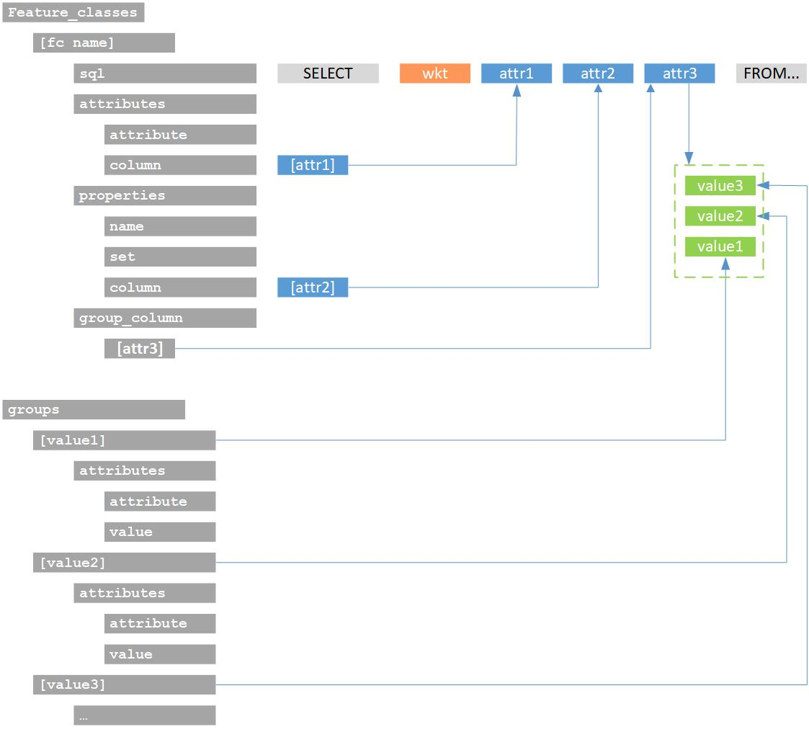

# cs2bim

- [cs2bim](#cs2bim)
- [Project description](#project-description)
    - [Resulting IFC Files](#resulting-ifc-files)
- [Concepts](#concepts)
- [Getting started](#getting-started)
    - [Getting started (Development)](#getting-started-development)
- [Configuration](#configuration)
    - [Configuration parameters (overview)](#configuration-parameters-overview)
    - [IFC configuration](#ifc-configuration)
        - [Geo referencing](#geo-referencing)
        - [Triangulation Representation Type](#triangulation-representation-type)
        - [Feature Classes](#feature-classes)
            - [SQL](#sql)
            - [Spatial Structure](#spatial-structure)
        - [Groups](#groups)
        - [Example](#example)
- [Known Issues](#known-issues)
- [Contact](#contact)
- [References](#references)

# Project description

The Conference of Cantonal Geoinformation and Cadastral Offices (KGK) has launched a research project *Cadastral
Surveying Data to Building Information Modelling (CS2BIM)*. The _Institute of Virtual Design and Construction_ and the
_Institute of Geomatics_ at the University of Applied Sciences Northwestern Switzerland (FHNW) have developed a service
based on open source libraries. The service transforms GIS-based cadastral survey (CS) data with area geometries (2D) to
IFC instances with 3D surface geometries. The geometry transformation is based on a projection of the 2D geometries onto
the digital terrain model.

The service contains the following major components:

- Importing and processing of INTERLIS data by the ili2pg component and storing in a PostGIS database. The vector data
  is read from [WKT](http://giswiki.org/wiki/Well_Known_Text) format.
- Processing of the terrain model data and creating the resulting 3D surfaces
- Exporting of the objects to IFC format using the IfcOpenShell component

{width=600}

The diagram shows the system architecture and all major components of the implementation. Description of the components:
| component | name | description |
| ------ |----- | ------ |
| 1 | PostGIS database | The cadastral data is imported from an INTERLIS (.xtf or itf) format via the standard component
ili2pg (swisstopo) and made available in a PostGIS database for further processing. The component database is not
covered within the code |
| 2 | DTM database | The digital terrain model (DTM) is loaded with the API service to swissALTI3D data. |
| 3 | wkt2tin | Component for creating 3D surfaces by projecting 2D vector objects (usually polygons) onto a terrain
model. As a result of this component, mesh surface geometries are available for each object instance (of the cadastral
information). |
| 4 | tin2ifc | This component writes the resulting IFC file. The open library IfcOpenShell is used for this purpose. |
| 5 | API & configuration | This service package combines the individual components with their configuration into a
‘CS2BIM’ service. The service is built in a docker container. |

## Resulting IFC Files

{width=1000}

Example files can be downloaded with the following links.

| ID | name              | link                                                | description                                                                                         |
|----|-------------------|-----------------------------------------------------|-----------------------------------------------------------------------------------------------------|
| 1  | 200mx200m.ifc     | https://drive.switch.ch/index.php/s/YOgygwb3ZqmG44v | All areas (parcel, landcover etc.) that intersect with the 200m x 200m polygon are included         | 
| 2  | 200mx200m_con.ifc | https://drive.switch.ch/index.php/s/2pivcwXtneYqSdY | All areas (parcel, landcover etc.) that are fully contained by the 200m x 200m polygon are included |
| 3  | 200mx200m_int.ifc | https://drive.switch.ch/index.php/s/Us2SHISz1XuMsGf | All areas (parcel, landcover etc.) are cut off at the border of the 200m x 200m polygon             |
| 4  | 500mx500m.ifc     | https://drive.switch.ch/index.php/s/NlH1WwYj6uC5NPc | All areas (parcel, landcover etc.) that intersect with the 500m x 500m polygon are included         | 

# Concepts

The cs2bim service supports different central IFC concepts and allows a relatively dynamic (configurable) transformation
between the geodata and the IFC data model. The main IFC concepts and principles of data transformation and processing
are briefly explained on the [Concepts](concepts.md) page.

# Getting started

Modify the configuration according to your needs/environment. Details about configuration [see below](#configuration).  
Prerequisites:

- The PostGIS database with the cadastral data is available (connection with psychopg is possible)
- The service to get terrain data is available

Build and run docker image

```console
docker-compose up
```

The run parameters are:

- IFC_VERSION: Ifc version of the resulting ifc file (supported versions/values, see [IFC version](src/cs2bim/ifc/enum/ifc_version.py)).
- NAME: Name of the resulting ifc file.
- POLYGON: The area in which the data is treated. The polygon must be a valid wkt string in LV95.
- PROJECT_ORIGIN (optional): The project origin in LV95 coordinates "Easting, Northing, Height". If the project origin is
  set, all other geometry values in the ifc are calculated relative to the origin.

Example:

```
curl -X 'POST' \
  'http://localhost:8000/generate-model/' \
  -H 'accept: application/json' \
  -H 'Content-Type: application/json' \
  -d '{
  "IFC_VERSION": "IFC4x3",
  "NAME": "API Test",
  "POLYGON": "POLYGON((2615490.59 1264657.53, 2615782.92 1264674.74, 2615747.00 1264604.23, 2615490.59 1264657.53))",
  "PROJECT_ORIGIN": "2600000,1200000,0"
}
```

Important: The config file (./config.yml) and the sqls (./sql/) are mounted from starting point (where docker is started). For the program to work, these files must be provided.

All generated ifc files are stored inside a docker volume called "ifc".
All log files are stored inside a docker volume called "ifc".

## Getting started (Development)

Build and run docker container or build and open a container with your IDE (e.g., VSCode, PyCharm)

```console
docker-compose -f docker-compose-dev.yml up 
```

Install pip packages (Run in container at /workspace)

```console
pip install --no-cache-dir --upgrade -r /workspace/requirements.txt
```

The application can be run in two modes: via the API server or by executing the standalone script with parameters (main.py).

### API

Run the Celery worker with x concurrent processes:

```console
cd /workspace/src
celery -A worker.app.app worker --concurrency=x
```

Launch the FastAPI development server with hot reload:

```console
cd /workspace/src
python -m uvicorn api.app:app --reload
```

### Standalone script

To run the application locally:

```console
cd /workspace/src
python main.py \
  --IFC_VERSION=<version> \
  --NAME=<name> \
  --POLYGON=<polygon> \
  --PROJECT_ORIGIN=<origin>
```

# API

## Endpoints

# Configuration

Some properties of this python project can be configured using the config.yml file.  
The configuration has different sections/topics:

- postgis configuration: Connection to the database with the cadastral data.
- stac configuration: Connection to the service that provides terrain data.
- tin configuration: Configurations for the creation and treatment of tins.
- ifc configuration: Configurations of the resulting ifc file.

## Configuration parameters (overview)

| Line Number | Key                                                                                                        | Type                                                                               | Values                                                                                                         | Example                                                                              |
|-------------|------------------------------------------------------------------------------------------------------------|------------------------------------------------------------------------------------|----------------------------------------------------------------------------------------------------------------|--------------------------------------------------------------------------------------|
| 0           | logging_level                                                                                              | str                                                                                | NOTSET; DEBUG; INFO; WARN; ERROR; CRITICAL                                                                     | "cs2bim"                                                                             |
| ---         | ---                                                                                                        | ---                                                                                | ---                                                                                                            | ---                                                                                  |
| 1           | db.dbname                                                                                                  | str                                                                                | *                                                                                                              | "cs2bim"                                                                             |
| 2           | db.user                                                                                                    | str                                                                                | *                                                                                                              | "postgres"                                                                           |
| 3           | db.host                                                                                                    | str                                                                                | *                                                                                                              | "host.docker.internal"                                                               |
| 4           | db.port                                                                                                    | int                                                                                | *                                                                                                              | 5432                                                                                 |
| 5           | db.password                                                                                                | str                                                                                | *                                                                                                              | "xxx"                                                                                |
| ---         | ---                                                                                                        | ---                                                                                | ---                                                                                                            | ---                                                                                  |
| 6           | dtm.stac_api                                                                                               | str                                                                                | *                                                                                                              | "https://data.geo.admin.ch/api/stac/v0.9/collections/ch.swisstopo.swissalti3d/items" |
| ---         | ---                                                                                                        | ---                                                                                | ---                                                                                                            | ---                                                                                  |
| 7           | tin.grid_size                                                                                              | float                                                                              | Depends on available eo:gsd values on dtm assets (Swisstopo: 0.5 / 2)                                          | 0.5                                                                                  |
| 8           | tin.max_height_error                                                                                       | float                                                                              | ≤ 0.05                                                                                                         | 0.05                                                                                 |
| ---         | ---                                                                                                        | ---                                                                                | ---                                                                                                            | ---                                                                                  |
| 9           | ifc.author                                                                                                 | str                                                                                | *                                                                                                              | "author"                                                                             |
| 10          | ifc.version                                                                                                | str                                                                                | *                                                                                                              | "1.0"                                                                                |
| 11          | ifc.application_name                                                                                       | str                                                                                | *                                                                                                              | "cs2bim"                                                                             |
| 12          | ifc.project_name                                                                                           | str                                                                                | *                                                                                                              | "Project A"                                                                          |
| 13          | ifc.geo_referencing                                                                                        | [GeoReferencing](src/config/geo_referencing.py)                                    | LO_GEO_REF_30; LO_GEO_REF_40; LO_GEO_REF_50                                                                    | LO_GEO_REF_30                                                                        |
| 14          | ifc.triangulation_representation_type                                                                      | [TriangulationRepresentationType](src/config/triangulation_representation_type.py) | TESSELLATION; BREP                                                                                             | BREP                                                                                 |
| 15          | ifc.feature_classes                                                                                        | map                                                                                | ---                                                                                                            | ---                                                                                  |
| 16          | ifc.feature_classes.<em>FeatureClassKeyX</em>                                                              | map                                                                                | ---                                                                                                            | ---                                                                                  |
| 17          | ifc.feature_classes.<em>FeatureClassKeyX</em>.sql                                                          | str                                                                                | <em>Path to sql file</em>                                                                                      | "sql/parcels.sql"                                                                    |
| 18          | ifc.feature_classes.<em>FeatureClassKeyX</em>.entity_type                                                  | [ElementEntityType](src/config/element_entity_type.py)                             | IFC_GEOGRAPHIC_ELEMENT                                                                                         | IFC_GEOGRAPHIC_ELEMENT                                                               |
| 19          | ifc.feature_classes.<em>FeatureClassKeyX</em>.attributes                                                   | list                                                                               | ---                                                                                                            | ---                                                                                  |
| 20          | ifc.feature_classes.<em>FeatureClassKeyX</em>.attributes.<em>ListElementX</em>                             | map                                                                                | ---                                                                                                            | ---                                                                                  |
| 21          | ifc.feature_classes.<em>FeatureClassKeyX</em>.attributes.<em>ListElementX</em>.attribute                   | str                                                                                | *                                                                                                              | "Name"                                                                               |
| 22          | ifc.feature_classes.<em>FeatureClassKeyX</em>.attributes.<em>ListElementX</em>.column                      | str                                                                                | *                                                                                                              | "egris_egrid"                                                                        |
| 23          | ifc.feature_classes.<em>FeatureClassKeyX</em>.properties                                                   | list                                                                               | ---                                                                                                            | ---                                                                                  |
| 24          | ifc.feature_classes.<em>FeatureClassKeyX</em>.properties.<em>ListElementX</em>                             | map                                                                                | ---                                                                                                            | ---                                                                                  |
| 25          | ifc.feature_classes.<em>FeatureClassKeyX</em>.properties.<em>ListElementX</em>.name                        | str                                                                                | *                                                                                                              | "Property"                                                                           |
| 26          | ifc.feature_classes.<em>FeatureClassKeyX</em>.properties.<em>ListElementX</em>.set                         | str                                                                                | *                                                                                                              | "PropertySet"                                                                        |
| 27          | ifc.feature_classes.<em>FeatureClassKeyX</em>.properties.<em>ListElementX</em>.column                      | str                                                                                | *                                                                                                              | "property_column"                                                                    |
| 28          | ifc.feature_classes.<em>FeatureClassKeyX</em>.spatial_structure                                            | map                                                                                | ---                                                                                                            | ---                                                                                  |
| 29          | ifc.feature_classes.<em>FeatureClassKeyX</em>.spatial_structure.entity_type                                | [SpatialStructureEntityType](src/config/spatial_structure_entity_type.py)          | IFC_SITE                                                                                                       | IFC_SITE                                                                             |
| 30          | ifc.feature_classes.<em>FeatureClassKeyX</em>.spatial_structure.attributes                                 | list                                                                               | ---                                                                                                            | ---                                                                                  |
| 31          | ifc.feature_classes.<em>FeatureClassKeyX</em>.spatial_structure.attributes.<em>ListElementX</em>           | map                                                                                | ---                                                                                                            | ---                                                                                  |
| 32          | ifc.feature_classes.<em>FeatureClassKeyX</em>.spatial_structure.attributes.<em>ListElementX</em>.attribute | str                                                                                | *                                                                                                              | "Name"                                                                               |
| 33          | ifc.feature_classes.<em>FeatureClassKeyX</em>.spatial_structure.attributes.<em>ListElementX</em>.value     | str                                                                                | *                                                                                                              | "Site"                                                                               |
| 34          | ifc.feature_classes.<em>FeatureClassKeyX</em>.group_columns                                                | list                                                                               | ---                                                                                                            | ---                                                                                  |
| 35          | ifc.feature_classes.<em>FeatureClassKeyX</em>.group_columns.<em>ListElementX</em>                          | str                                                                                | *                                                                                                              | "group_column"                                                                       |
| 36          | ifc.feature_classes.<em>FeatureClassKeyX</em>.color_definition                                             | map                                                                                | ---                                                                                                            | ---                                                                                  |
| 37          | ifc.feature_classes.<em>FeatureClassKeyX</em>.color_definition.r                                           | float                                                                              | 0.0 - 1.0                                                                                                      | 0.1                                                                                  |
| 38          | ifc.feature_classes.<em>FeatureClassKeyX</em>.color_definition.g                                           | float                                                                              | 0.0 - 1.0                                                                                                      | 0.5                                                                                  |
| 39          | ifc.feature_classes.<em>FeatureClassKeyX</em>.color_definition.b                                           | float                                                                              | 0.0 - 1.0                                                                                                      | 0.5                                                                                  |
| 40          | ifc.feature_classes.<em>FeatureClassKeyX</em>.color_definition.a                                           | float                                                                              | 0.0 - 1.0                                                                                                      | 0.3                                                                                  |
| 41          | ifc.groups                                                                                                 | map                                                                                | ---                                                                                                            | ---                                                                                  |
| 42          | ifc.groups.<em>IfcGroupKey</em>                                                                            | map                                                                                | ---                                                                                                            | ---                                                                                  |
| 43          | ifc.groups.<em>IfcGroupKey</em>.entity_type                                                                | [GroupEntityType](src/config/group_entity_type.py)                                 | IFC_DISTRIBUTION_SYSTEM, IFC_DISTRIBUTION_CIRCUIT, IFC_BUILDING_SYSTEM, IFC_STRUCTURAL_ANALYSIS_MODEL, IFC_ZONE | IFC_DISTRIBUTION_SYSTEM                                                              |
| 44          | ifc.groups.<em>IfcGroupKey</em>.attributes                                                                 | list                                                                               | ---                                                                                                            | ---                                                                                  |
| 45          | ifc.groups.<em>IfcGroupKey</em>.attributes.<em>ListElementX</em>                                           | map                                                                                | ---                                                                                                            | ---                                                                                  |
| 46          | ifc.groups.<em>IfcGroupKey</em>.attributes.<em>ListElementX</em>.attribute                                 | str                                                                                | *                                                                                                              | "Name"                                                                               |
| 47          | ifc.groups.<em>IfcGroupKey</em>.attributes.<em>ListElementX</em>.value                                     | str                                                                                | *                                                                                                              | "Group"                                                                              |

## STAC Configuration

There are two stac v0.9 urls that can be provided in the config. There are several conditions that need to be fulfilled:
- The provided urls must point to the according stac collection items
- The features / items must set the property: feature.properties.datetime

### DTM

Needs to be set if there are clipped_terrain feature classes configured. 
Expected asset properties:

- type = application/x.ascii-xyz+zip
- eo:gsd = config.tin.grid_size

### Buildings

Needs to be set if there are buildings feature classes configured.
Expected asset properties:

- type = application/x.gml+zip

## IFC configuration

In this section of the configuration you can make some general definitions about the resulting ifc file, and you can
define the feature classes that are generated and exported as ifc entities.

Below some parameters are explained.

### Geo referencing

You can provide the so-called "Level of Georeferencing" (LoGeoRef), according to (Clemen&Görne, 2019) [^LoGeoRef].  
The different levels represent different methods of defining information about georeferencing in IFC.  
Supported values are:

- LO_GEO_REF_30
    - IfcObjectPlacement of an IfcSpatialStructureElement contains georeferencing
    - Suitability for local projects on a smaller scale
    - IFC 2.3
- LO_GEO_REF_40
    - IfcGeometricRepresentation context of IfcProject contains georeferencing
    - Suited for larger infrastructure projects
    - IFC 2.3
- LO_GEO_REF_50
    - IfcMapConversion defines georeferencing of the "SurveyPoint", including coordinate system parameters
    - Suited for large-scale and linear project expansions
    - IFC 4.0

{width=600}

**Coordinates and Offsets**  
You can provide a project origin in LV95 coordinates (Easting, Northing, Height). The project origin can also be set
to (0,0,0).  
If not provided, the system sets a project origin calculated on a minimum bounding box of the perimeter.

{width=600}

### Triangulation Representation Type

You can define the representation type used to represent the TIN geometry in the ifc.  
Supported values are TESSELLATION or BREP. TESSELATION is recommended because it needs less storage space.

### Feature Classes

A "Feature Class" is the definition of a set of objects that are exported in an IFC entity with common definitions.
The main configurations of a feature class include:

- sql: A SQL query that selects objects in the GIS database, returning a geometry (must be an area) and some other
  attributes for each object.
- entity_type: The IFC entity, to which all selected objects of the feature class are exported to.
- attributes: All attributes that are set on the objects.
- properties: Any number of property definitions that are exported as IFC properties/property sets.
- group_columns: Any number of IFC group assignments.
- spatial_structure: The IFC spatial structure, to which all objects of the feature class are appended.
- color: An IFC color definition

{width=300}

#### SQL

For each feature class you have to provide a SQL file for querying the data. With the query you are selecting the
cadastral data (with an area geometry type). The SQL query requires taking a polygon wkt as parameter "%(polygon)s" and 
returning a column named "wkt" with wkt string values. To guarantee correct processing, it is important to check that the
sql also delivers all columns that are additionally configured for the according feature class. This can be multiple
columns for attributes, properties or groups.

The following schema shows the relationship between the attributes defined by the sql query and their linking to the
configuration.  
{width=600}

#### Spatial Structure

All objects of a feature class are assigned to one common spatial structure. The spatial structure instance can be
configured with its entity type and attributes.

If the specification of the spatial structure instance in different feature class definitions is identical, then only
one spatial structure instance is created (and all objects of the feature classes are assigned to the same spatial
structure).

### Groups

Every exported object can be assigned to a group (zero to multiple). If defined empty (groups: []), no groups are
created. The assignment is defined by an attribute value (of the SQL query). For each attribute value used as a
group assignment, there should be a group configuration.
For each group assignment the system is creating an ifc group according to the group configuration with its parameters 
(entity_type and any number of attributes). When there is no group configuration for an assigned value, the system will
create a simple ifc group entity without any special attributes.

When defining a group, you can use "." to create nested group structures. (IfcGroupKey)

### Example

config.yml

```yaml
...
author: "FHNW"
version: "1.0"
application_name: "cs2bim"
project_name: "cs2bim"
geo_referencing: LO_GEO_REF_30
triangulation_representation_type: TESSELLATION
feature_classes:
  parcel:
    sql: "sql/parcels.sql"
    entity_type: IFC_GEOGRAPHIC_ELEMENT
    attributes:
      - attribute: "PredefinedType"
        column: "predefined_type"
    properties:
      - name: "NBIdent"
        set: "CHKGK_CS"
        column: "nbident"
    spatial_structure:
      entity_type: IFC_SITE
      attributes:
        - attribute: "CompositionType"
          value: "COMPLEX"
    group_columns:
      - "group"
    color_definition:
      r: 0.31
      g: 0.67
      b: 0.04
      a: 0.85
groups:
  Amtliche Vermessung.Gebaeude:
    entity_type: IFC_BUILDING_SYSTEM
    attributes:
      - attribute: "PredefinedType"
        value: "USERDEFINED"
...
```

sql/feature_class_x.sql

```sql
with perimeter as (select ST_GeomFromText(%(polygon)s, 2056) as geom)
select ST_AsText(ST_CurveToLine(geometrie, 1)) as wkt,
       nbident                                 as name_column,
       nummer                                  as property_column,
       CASE
           WHEN x THEN 'Amtliche Vermessung.Feature-Klassen.x'
           ELSE 'Amtliche Vermessung.Feature-Klassen.y'
           END as
group
from
    cs2bim.liegenschaft l
    left join cs2bim.grundstueck g
on (l.liegenschaft_von = g.t_id)
    join perimeter on ST_Intersects(geometrie, perimeter.geom)
```

Useful postgis functions:

ST_GeomFromText → Constructs a PostGIS ST_Geometry object \
ST_AsText → Returns the OGC WKT representation of the geometry\
ST_CurveToLine → Converts a given geometry to a linear geometry\
ST_Intersects → Returns true if two geometries intersect. Geometries intersect if they have any point in common.
ST_Contains → Returns true if the first geometry contains the second.

# Known Issues

- Only one supported geometry type: All feature classes are processed the same way and are implemented to represent a
  surface that is projected to the terrain. Until now no support of e.g. points, lines or parametrized geometries.
- Entity types that are only supported in one of the two allowed ifc versions (4, 4x3) are not supported (e.g.,
  IfcBuiltSystem). Explanation: There is no switch in the code that could deal with different cases based on a different
  ifc version, neither are there parameters in the configuration to support different ifc versions.
- Potential code optimization not yet done (parallelize computational tasks with threads, cache dtm data, load only
  necessary dtm data in memory, process the point cloud only once and then derive feature class geometries from TIN instead
  of point clouds)
- No support for the ifc classification concept. Could be done the same way as the already implemented group concept.

# Contact

{width=250}

Fachhochschule Nordwestschweiz, Institut Digitales Bauen, 4132 Muttenz \
University of Applied Sciences and Arts Northwestern Switzerland, Institute of Virtual Design and Construction

Project head

- Oliver Schneider
- Prof. Lukas Schildknecht

Project staff

- Prof. Christian Gamma
- Joel Gschwind
- Jonas Meyer

If you use this project for your research, please cite:

```
  @inproceedings{schildknecht2025cs2bim,
    author={Schildknecht, Lukas and Schneider, Oliver and Meyer, Jonas, and Gamma, Christian and Gwschind, Joel},
    title={Integration of land administration data into BIM/IFC - an open source approach for Swiss cadastral survey data},
    year={2025},
    booktitle={Dreiländertagung der DGPF, der OVG und der SGPF in Muttenz, Schweiz},
    series={Publikationen der DGPF},
    volume={Band 33},
    editor={Kersten, Thomas P. and Tilly, Nora},
    publisher={Deutsche Gesellschaft für Photogrammetrie, Fernerkundung und Geoinformation (DGPF) e.V.},
    address={Stuttgart, Germany},
    pages={294--310}
  }
```

# References

[^LoGeoRef]: "Clemen, C., Görne, H., 2019. Level of Georeferencing (LoGeoRef) using IFC for BIM. Journal of Geodesy,
Cartography and Cadastre, 10/2019, S. 15-20. ISSN: 1454-1408" .  