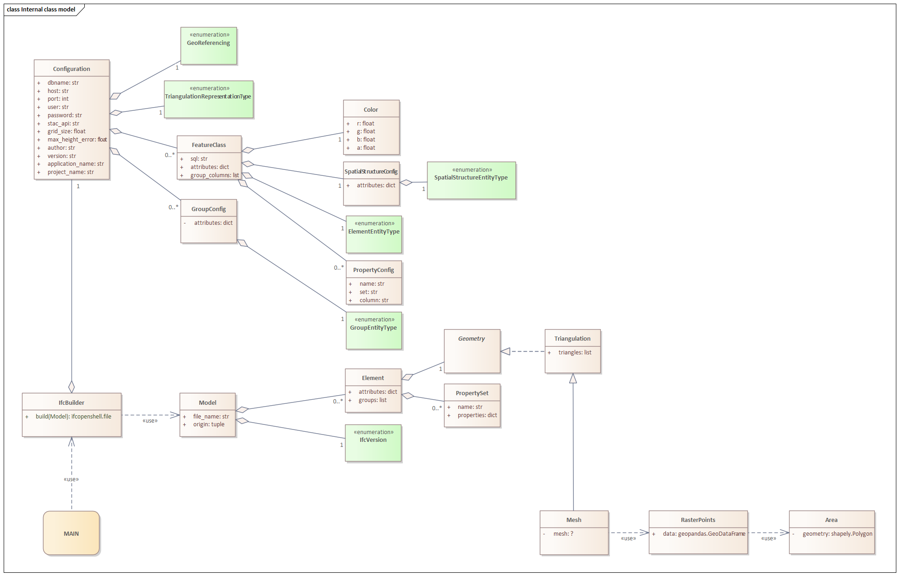

On this page some basics and concepts of the cs2bim project are documented.

- [IFC basic principles](#ifc-basic-principles)
- [Transformation GIS --\> IFC](#transformation-gis----ifc)
- [Internal object model](#internal-object-model)
- [Projection and triangulation](#projection-and-triangulation)
- [References](#references)

# IFC basic principles
The "Industry Foundation Classes" (IFC) is an open, international standard that defines a conceptual data model for buildings. It is developped and maintained by buildingSmart International and documented in an open HTML based documentation (IFC-Doc)[^IFC-Doc]. IFC is also published as an ISO standard (ISO16739-1)[^ISO16739-1], that is identical to the open standard.  

IFC defines a large data model. In the context of cs2bim, the core of the IFC data model can be described (simplified) with the following structures (see also (Schildknecht, 2023)[^Schildknecht-2023]).
- IfcElement:  
IfcElement is an abstact entity that can be specialised with a lot of different, conrete "business" entities, e.g. IfcDoor, IfcWall etc. The individual semantics of all enitities is definied in (IFC-Doc)[^IFC-Doc]. In the context of cs2bim, IfcGeographicElement is currently the main candidate to be used. 
- IfcPropertySet:  
IfcPropertySet (with Properties) is a generic strucutre within IFC that allows the assignment of arbitrary properties to an IfcElement. 
- IfcShapeRepresentation:  
An IfcElement can have zero, one or multiple geometric representations. The "RepresentationIdentifier" defines the type of representation. Possible identifiers could be "Body" (for a 3D representation) or "Axis", amongst others.  
The geometry type is defined by the "RepresentationType" and could be Point, Curve, Surface, SweptSolid and others.
- IfcSpatialStructureElement:  
An IfcElement can be assigned to a spatial structure element. IfSpatialStructureElements are used to define a spatial-logical structure (typically building-storey-space in buildings; typically segments and cross-sections in infrastructure constructions). In the context of cs2bim, the IfcSpatialStructure is also "misused" for a functional grouping of the elements (without spatial-logical structure).
- IfcGroup
In IFC, any groups can be defined for any subject/functional grouping of elements. The groups can also be structured hierarchically. An IfcElement can be assigned to any group.
- IfcClassificationReference
As an alternative to IfcGroup, an IfcElement can be assigned to a classification value. Classification values belong to classifications that are typically defined outside of IFC.   

![IFC principles (simplified), according to [^Schildknecht-2023]](./uploads/ifc-principles.png){width=600}

The data model shown above is simplified and conceptualised. In fact, the data model of IFC is much more structured and uses, amongst other things, inheritance relationships and relationship classes. The figure below shows the same core elements again, but taking into account the most important inheritance relationships from IFC (note: this figure is also a simplified representation).  

{width=600}

# Transformation GIS --> IFC
The transformation of a GIS feature class into the IFC schema takes place as shown in the following figure.

{width=600}

The entity mapping determines for which IFC entity an instance is created for each feature of the feature class.  
The attribute values of a feature can be transformed into 
- an attribute value of the entity instance
- a property value of the entity instance
- in a group assignment of the entity instance
- in a classification value assignment of the entity instance (not implemented, not shown in figure above)

The GIS geometry is transformed into a "Body" geometry of IFC. In the current implementation, only 2D surface geometries are supported in the source geometry. These are transformed into 3D surfaces (preferably of the tesselation type). In future developments, it is planned to support different geometry types in the feature classes and to be able to convert them into different geometry types of IFC.  

The GIS geometry is expected to be in WKT format ([ISO 19125-1])[^ISO19125-1]. If the geodata source is in INTERLIS format (ILI-RefMan)[^ILIRefMan], a preprocess must be run to transform it to the WKT format (e.g. ili2pg).

# Internal object model

{width=600}

# Projection and triangulation

Based on the available digital terrain model (DTM) represented as uniformly sampled grid points any 2D polygon object is converted into a 3D surface object. The 2D polygon object is assumed to be represented as WKT-string and to have no circular arcs.
First, all grid points within a specific buffer (user-definable argument) around the 2D polygon object are extracted. A 2D Delaunay triangulation is applied to the retrieved subset of grid points to obtain a triangulated irregular network (TIN). Then, the vertices of the polygon object are projected onto the surface by using raytracing along the z-unit vector (0,0,1). For each line segment of the polygon object a vertical plane is defined and intersection points of all triangle edges are calculated. The new surface object with all grid points within the polygon object and a boundary consisting of all vertices and intersection point is defined. The new surface is again triangulated using a 2D Delaunay triangulation. To reduce the number of triangles it is possible to apply a simplification of the TIN by specifying the maximum acceptable height error (user-definable argument). The following figure shows the geometry conversion schematically.

{width=600}

The resulting 3D surfaces fulfill the 2D area constrains which are relevant for land coverage and property layer. However, since for every 2D polygon object a subset of grid points is triangulated by a 2D Delaunay triangulation, which does not find an optimal solution in the case of uniformly distributed grid points, there may be some small holes between two consecutive objects. This problem can be mitigated by using a 3D triangulation method instead, which is, however, much more computationally expensive.

[Here](examples/example.ipynb) you can find a more detailed explanation of the code.

# References
[^IFC-Doc]: buildingSmart International, 2023. IFC4.3.2.0 Documentation (official 4.3.2.0) [WWW Document]. URL https://standards.buildingsmart.org/IFC/RELEASE/IFC4_3/index.html .  
[^ISO16739-1]: ISO 16739-1, 2024. ISO 16739-1:2024 Industry Foundation Classes (IFC) for data sharing in the construction and facility management industries — Part 1: Data schema.  
[^Schildknecht-2023]: Schildknecht, L., 2023. Leitungskataster nach SIA405 - Analyse zur Nutzung von IFC. Phase0 - Journal für integriertes Planen, Bauen und Betreiben. https://doi.org/10.21428/71cd88bc.016ca100  
[^ISO19107]: ISO 19107, 2019. ISO 19107:2019 Geographic Information - Spatial Schema.  
[^ISO19125-1]: ISO 19125-1, 2006. ISO 19125-1:2006 Geographic information - Simple feature access - Part 1: Common architecture.    
[^ILIRefMan]: eCH-0031 iliRefMan, 2017. eCH-0031 INTERLIS 2 - Referenzhandbuch, Version 2.0.  

