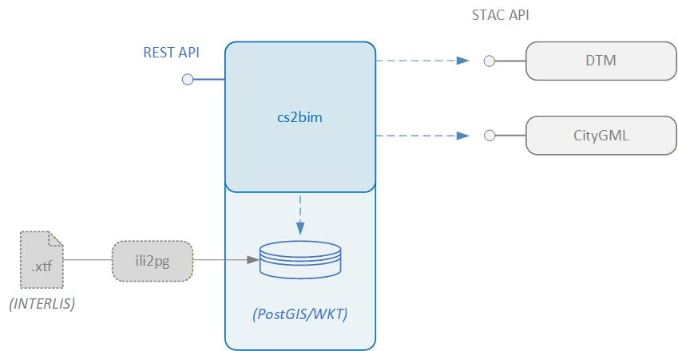
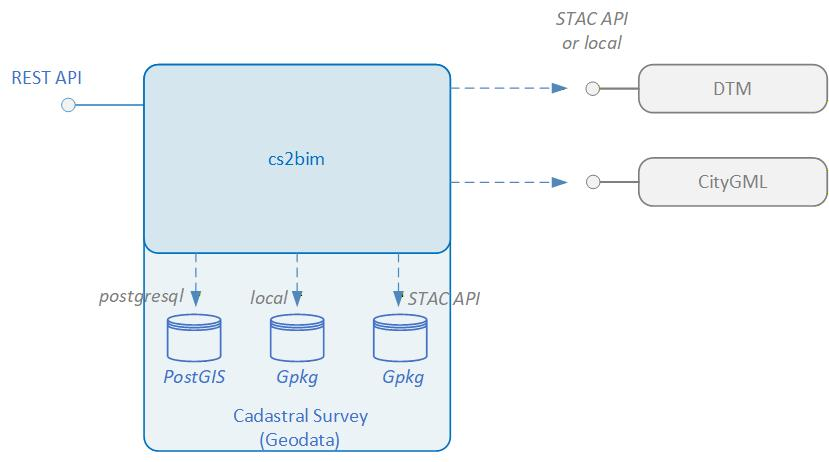
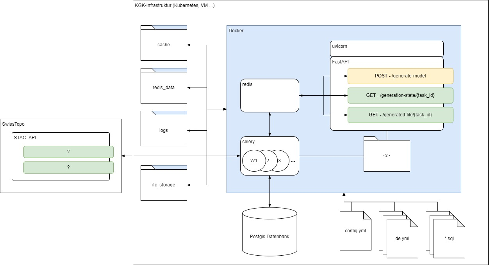

# Architecture

## System architecture

### Context
The service cs2bim is designed with the following conceptual components:  

{fig-align="left" width=65%}

  
| Component   | Description                                                                                                                                              |
| ----------- | -------------------------------------------------------------------------------------------------------------------------------------------------------- |
| cs2bim      | Main component to transform feature types into IFC instances. Including transformation algorithms, IFC serialisation, service task management etc.      |
| PostGIS/WKT | Database holding the GIS feature types. In current state, this is a PostGIS database. The component cs2bim has a postgres connection to the database. |
| DTM         | Data store with Digital Terrain Model data. DTM data is expected in format XYZ. The cs2bim component gets the DTM data over a STAC API request.          |
| CityGML     | Data store with CityGML data. CityGML data is expected in version 2 of CityGML. The cs2bim component gets the CityGML data over a STAC API request.      |
| REST API    | REST API to interact with cs2bim: Start processing, get status of processing, get generated IFC file.                                                    |
| ili2pg      | External component to transform INTERLIS data into PostGIS. This must be done as a standalone pre process.                                               |

  
The following architectural enhancements are already being discussed and proposed as potential next steps for the further development and improvement of the service:  

{fig-align="left" width=65%}
  
- Geopackage as additional data source format for GIS feature types.
  - Geopackage files could be stored locally (on the server) or could be accessed via STAC API
- DMT files stored locally (on the server)
- CityGML files stored locally (on the server)

These improvements would simplify the “local” execution of the service as a “standalone” application, as originally intended.

### Internal

