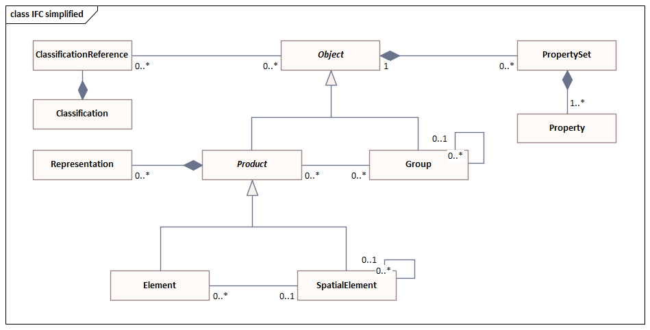
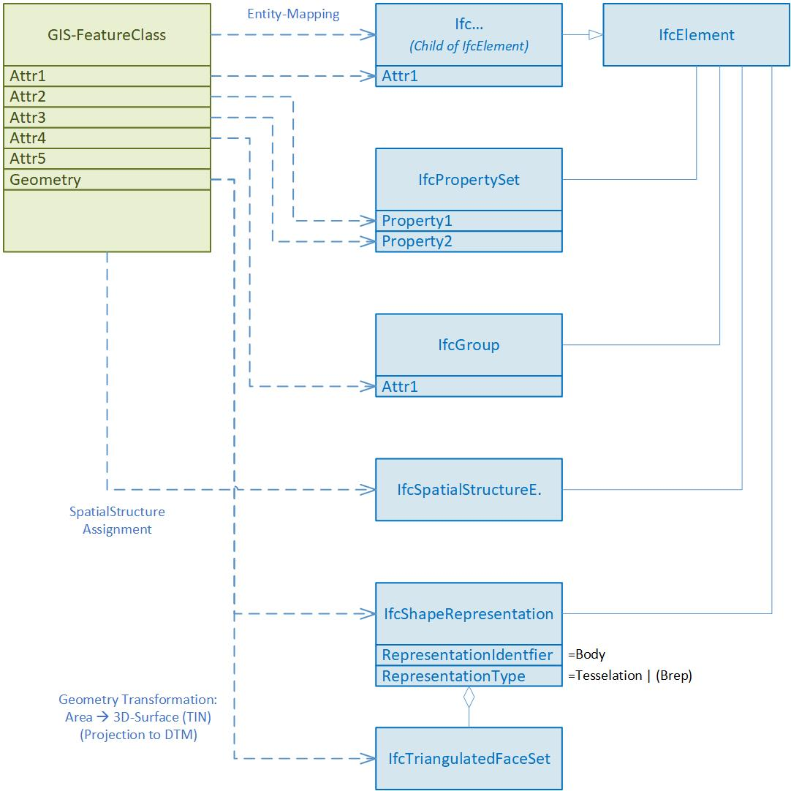
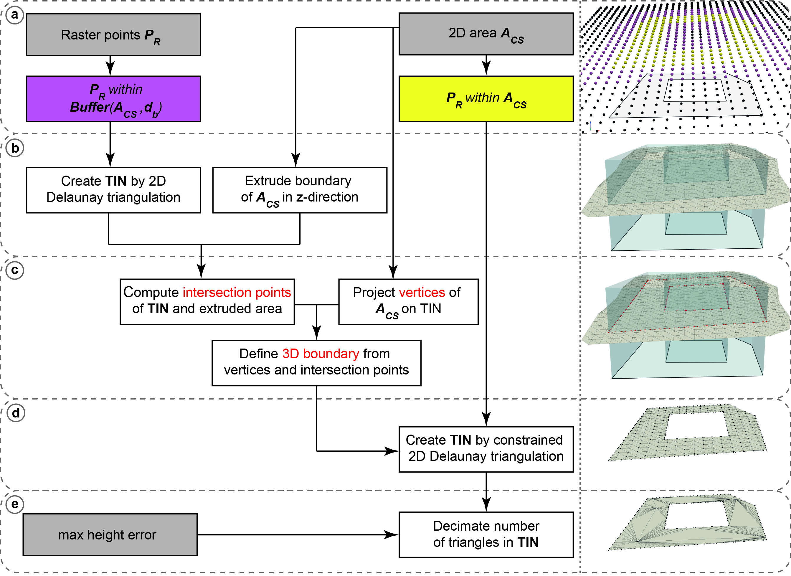
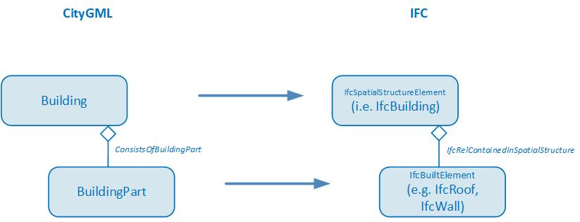
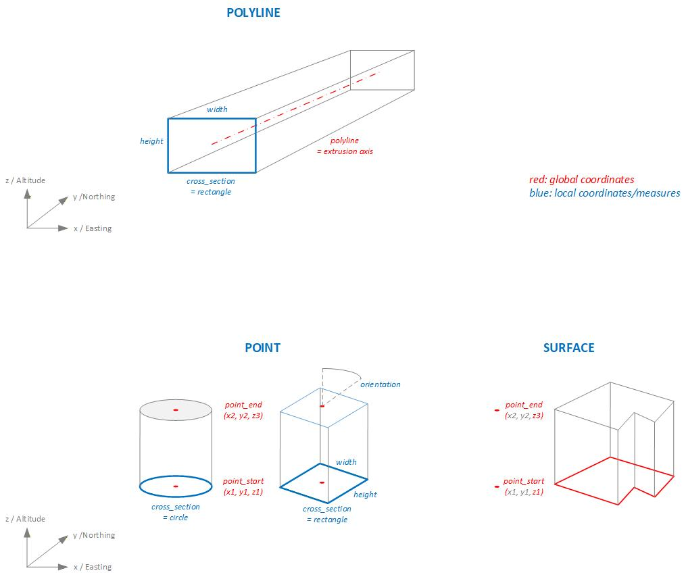

# Concepts

On this page some basics and concepts of the cs2bim project are documented.

- [IFC basic principles](#ifc-basic-principles)
- [Transformation GIS --\> IFC](#transformation-gis----ifc)
- [Projection and triangulation](#projection-and-triangulation)
- [CityGML / 3D city model](#citygml--3d-city-model)
- [Extrusions](#extrusions)


## IFC basic principles
The "Industry Foundation Classes" (IFC) is an open, international standard that defines a conceptual data model for buildings. It is developped and maintained by buildingSmart International and documented in an open HTML based documentation [@buildingsmartinternational2023IFC4320DocumentationOfficial]. IFC is also published as an ISO standard [@iso2024ISO1673912024], that is identical to the open standard.  

IFC defines a large data model. In the context of cs2bim, the core of the IFC data model can be described (simplified) with the following structures (see also [@schildknecht2023LeitungskatasterNachSIA405]).  

- **IfcElement**  
IfcElement is an abstact entity that can be specialised with a lot of different, conrete "business" entities, e.g. IfcDoor, IfcWall etc. The individual semantics of all enitities is definied in [@buildingsmartinternational2023IFC4320DocumentationOfficial]. In the context of cs2bim, IfcGeographicElement is currently the main candidate to be used.  
- **IfcPropertySet**  
IfcPropertySet (with Properties) is a generic strucutre within IFC that allows the assignment of arbitrary properties to an IfcElement.  
- **IfcShapeRepresentation**  
An IfcElement can have zero, one or multiple geometric representations. The "RepresentationIdentifier" defines the type of representation. Possible identifiers could be "Body" (for a 3D representation) or "Axis", amongst others.  
The geometry type is defined by the "RepresentationType" and could be Point, Curve, Surface, SweptSolid and others.
- **IfcSpatialStructureElement**  
An IfcElement can be assigned to a spatial structure element. IfSpatialStructureElements are used to define a spatial-logical structure (typically building-storey-space in buildings; typically segments and cross-sections in infrastructure constructions). In the context of cs2bim, the IfcSpatialStructure is also "misused" for a functional grouping of the elements (without spatial-logical structure).
- **IfcGroup**  
In IFC, any groups can be defined for any subject/functional grouping of elements. The groups can also be structured hierarchically. An IfcElement can be assigned to any group.
- **IfcClassificationReference**  
As an alternative to IfcGroup, an IfcElement can be assigned to a classification value. Classification values belong to classifications that are typically defined outside of IFC.   

![IFC principles (simplified), according to [@schildknecht2023LeitungskatasterNachSIA405]](../uploads/ifc-principles.png){#fig-ifc-principles}


The data model shown above is simplified and conceptualised. In fact, the data model of IFC is much more structured and uses, amongst other things, inheritance relationships and relationship classes. The figure below shows the same core elements again, but taking into account the most important inheritance relationships from IFC (note: this figure is also a simplified representation).  

{#fig-ifc-simplified}


## Transformation GIS --> IFC
The transformation of a GIS feature type into the IFC schema takes place as shown in the following figure.

{#fig-transformation-gis-ifc fig-align="left" width=65%}

The entity mapping determines for which IFC entity an instance is created for each feature of the feature type.  
The attribute values of a feature can be transformed into  

- an attribute value of the entity instance
- a property value of the entity instance
- in a group assignment of the entity instance
- in a classification value assignment of the entity instance (not implemented, not shown in figure above)

The GIS geometry is transformed into a "Body" geometry of IFC. In the current implementation, only 2D surface geometries are supported in the source geometry. These are transformed into 3D surfaces (preferably of the tesselation type). In future developments, it is planned to support different geometry types in the feature types and to be able to convert them into different geometry types of IFC.  

The GIS geometry is expected to be in WKT format [@iso2006ISO1912512006]. If the geodata source is in INTERLIS format [@ech2024ECH0031INTERLIS2], a preprocess must be run to transform it to the WKT format (e.g. ili2pg).

## Projection and triangulation

Based on the available digital terrain model (DTM) represented as uniformly sampled grid points any 2D polygon object is converted into a 3D surface object. The 2D polygon object is assumed to be represented as WKT-string and to have ***no circular arcs***.  
First, all grid points within a specific buffer (user-definable argument) around the 2D polygon object are extracted. A 2D Delaunay triangulation is applied to the retrieved subset of grid points to obtain a triangulated irregular network (TIN). Then, the vertices of the polygon object are projected onto the surface by using raytracing along the z-unit vector (0,0,1). For each line segment of the polygon object a vertical plane is defined and intersection points of all triangle edges are calculated. The new surface object with all grid points within the polygon object and a boundary consisting of all vertices and intersection point is defined. The new surface is again triangulated using a 2D Delaunay triangulation. To reduce the number of triangles it is possible to apply a simplification of the TIN by specifying the maximum acceptable height error (user-definable argument). The following figure shows the geometry conversion schematically.

{#fig-geometry-conversion}

The resulting 3D surfaces fulfill the 2D area constrains which are relevant for land coverage and property layer. However, since for every 2D polygon object a subset of grid points is triangulated by a 2D Delaunay triangulation, which does not find an optimal solution in the case of uniformly distributed grid points, there may be some small holes between two consecutive objects. This problem can be mitigated by using a 3D triangulation method instead, which is, however, much more computationally expensive.

**Note**: The conversion process was reworked to fix problems with holes on shared edges. Key changes include:

- **Two-tier raster point extraction**: Separate buffer zone points (for grid structure) and strictly internal points (for triangulation)
- **Grid-based boundary densification**: Polygon edges are densified using intersections with horizontal, vertical and diagonal grid lines instead of raytracing
- **Constrained Delaunay triangulation**: Single triangulation with boundary constraints instead of the two-step projection approach
- **Post-triangulation height assignment**: Z-coordinates computed via barycentric interpolation after 2D triangulation, rather than raytracing projection


## CityGML / 3D city model
In this project the transformation of 3D city models is based on CityGML, version 2 [@groger2012OGCCityGeography].  
The data model of CityGML comprises different thematic modules. In addition to the Core module, only the Building module is processed for the transformation of the 3D city model.  

![CityGML v2, Modules (based on [@groger2012OGCCityGeography])](../uploads/citygml-modules.jpg){#fig-citygml-modules}


### Building structure

Within the Building module, the two classes (features) ```Building``` and ```BuildingPart``` are taken into account, including their bounding surface objects  ```_BoundarySurface```, such as, for example, ```RoofSurface```, ```WallSurface```, ```GroundSurface``` etc.  
Finer structuring of the building, such as ```BuildingInstallation```, ```BuildingFurniture``` or ```Room```, has not been considered in this project, since no data for these classes are available in the used source dataset (SwissBuildings3D).  

![CityGML v2, Building model (based on [@groger2012OGCCityGeography])](../uploads/citygml-building.jpg){#fig-citygml-building}


For the mapping between CityGML and IFC the aggregation hierarchy between ```Building``` and ```BuildingPart``` of CityGML is converted into a hierarchy between building elements (child elements of ```IfcBuiltElement```) and spatial structure elements (child elements of ```IfcSpatialStructureElement```) using the spatial containment concept (```IfcRelContainedInSpatialStructure```).  

{#fig-citygml-ifc-mapping fig-align="left" width=65%}

### Geometry types
CityGML supports different geometry types of GML. For the transformation of 3D city models with a focus on buildings, the support of solid and simple surface geometries is sufficient. The following figure shows the geometry types relevant and supported for the transformation of buildings in this project (i.e. the simple geometries ```Solid```, ```Polygon``` with ```LinearRing``` and the composite geometries ```CompositeSolid```, ```CompositeSurface``` and ```MultiSurface```)
 
![CityGML v2, geometry primitives (based on [@groger2012OGCCityGeography])](../uploads/citygml-geometry-primitives.jpg){#fig-citygml-geometry-primitives}

![CityGML v2, geometry complexes (based on [@groger2012OGCCityGeography])](../uploads/citygml-geometry-complexes.jpg){#fig-citygml-geometry-complexes}


The conversion from the GML geometry type to the IFC geometry type is defined according to the following table:  

| GML Geometry     | IFC Geometry     |
| :--------------- | :--------------- |
| Solid            | Brep             |
| Polygon          | PolygonalFaceSet |
| CompositeSolid   |                  |
| CompositePolygon |                  |
| Multisurface     |                  |
: CityGML geometry IFC mapping {#tbl-citygml-ifc-mapping}


## Extrusions
A typical use case for transforming geodata into IFC format involves utility cadastre data. In Switzerland there is a standard data model for utility cadastre called "LKMap", which is specified in [@sia2025SIA4052025] and [@sia2025SIA40082025]. This information is often referred to as 2.5D, since it is primarily defined in 2D with additional height data.  
To enable the conversion of pipe elements to IFC, the transformation needs special geometry conversion functions that can be used to generate extruded geometries.
In accordance with the principles of SIA 405, two main methods can be distinguished for creating solid geometries from the 2.5D data in LKMap using extrusion:  

- Extrusion along a polyline:  
A cross-section is extruded along a 3D polyline. This method is used specifically for pipes (LKLine).  
In LKMap, the standard cross-sectional shapes are circle, ellipse, and rectangle. In specialized building information models, it is generally possible to specify freely definable cross-sectional shapes that deviate from the standard profiles. However, this is not possible with LKMap.
- Vertical extrusion:  
A base area is extruded vertically between two elevation points. This method is used specifically for shaft structures (LKPunkt, LKFlaeche). 
The base area can be defined by any 2D polygon. However, circular base areas (shafts) are also common in the utility cadastre.  

For vertical extrusion of utility cadastre objects, two main cases can be distinguished:  

- Point objects with standardized cross-sections
- Area shaped objects (surface)

In the GIS cadastre, all geometric data is defined in global coordinate systems (e.g. LV95).  
In GIS cadastres, point objects are defined solely as point geometry in global coordinates (e.g. LV95). Symbols can be used to represent the point object with a geometric shape. For area objects, however, the entire geometric shape (the surface geometry) is defined in global coordinates. The shape of the surface can be defined arbitrarily.
This fact is also taken into account in the transformation functions of the extrusion, so that three basic methods can be distinguished:  

- POLYGON: For the extrusion of pipes along an axis (polygon).
- POINT: For the extrusion of point objects.
- SURFACE: For the extusion of area/surface objects.

The following figure shows a schematic representation of the different types of extrusion:  

{#fig-extrusion-types}


Depending on the type of extrusion and the cross section, different additional parameters are required to define the extrusion algorithm. The following table lists the extrusion parameters required for each type of extrusion, while the table below explains each parameter in detail.  

|   |   |   |   |   |   |   |   |   |
|:--|:--|---|---|---|---|---|---|---|
|extrusion_type|cross_section_type|polyline|point_start|point_end|height|width|orientation|polygon|
|POLYLINE|CIRCLE, EGG   |x| | | |x| | |
|POLYLINE|RECTANGLE     |x| | |x|x| | |
|POLYLINE|POLYGON_LOCAL |x| | | | | |x(1)|
|POINT   |CIRCLE        | |x|x| |x| | |
|POINT   |RECTANGLE     | |x|x|x|x|x| |
|POINT   |POLYGON_LOCAL | |x|x| | |x|x(1)|
|SURFACE |POLYGON_GLOBAL| |x|x| | | |x(2)|
: Extrusion parameter usage {#tbl-extrusion-parameter-usage}

(1) Polygondefinition in lokalem Koordinatensystem  
(2) Polygondefinition in LV95  


| Parameter          | Beschreibung|
|:-------- |:----------- |
| extrusion_type     | POLYLINE extruding along 3D polyline.<br>POINT extruding point geometry between two points.<br>SURFACE extruding surface geometry. Extrusion vector and lenght is defined by two points |
| cross_section_type | CIRCLE<br>EGG<br>RECTANGLE<br>POLYGON_LOCAL arbitrary cross sections defined in local coordinate system<br>POLYGON_GLOBAL arbitrary cross sections defined in global coordinate system |
| polyline           | Extrusion axis for extrusion_type = POLYLINE;<br>3D polyline in WKT format.<br>The extrusion axis is centered in the cross-section with respect to both height and width. |
| point_start        | Starting point for extrusion for extrusion_type = POINT, SURFACE;<br>3D point in WKT format, global coordinate system (e.g. LV95)  |
| point_end          | Ending point for extrusion for extrusion_type = POINT, SURFACE;<br>3D point in WKT format, global coordinate system (e.g. LV95)<br>  |
| height             | Height of the cross section in [m] |
| width              | Width of the cross section in [m]  |
| orientation        | If extrusion_type = POINT and cross_section_type = RECTANGELE, POLYGON. Orientation of the cross section.<br>Degrees 0.0 .. 359.9  |
| polygon            | Cross section, 2D polygon in WKT format in [m].<br><br>If extrusion_type = _POLYLINE_:  <br>A cross-sectional area defined in a local coordinate system in which the extrusion axis passes through the origin (0,0). The cross-sectional area is always defined as being orthogonal to the extrusion axis.<br><br>If extrusion_type = _POINT_:  <br>A cross-sectional area in local coordinate system. The area is always defined in the xy-plane of the parent, absolute coordinate system (e.g. LV95).<br>The cross-sectional area is extruded between the points point_start and point_end without being rotated relative to the xy-plane.<br><br>If extrusion_type = _SURFACE_:  <br>Surface in absolute coordinate system (e.g. LV95). The surface is always defined in the xy-plane of the parent coordinate system (e.g. LV95). The surface is extruded between the z-values of the points point_start and point_end and in the direction defined by point_start and point_end, without being rotated relative to the xy-plane. |
: Extrusion parameters {#tbl-extrusion-parameters}
  
<br>
<br>  

The conversion of the extrusion types described above into IFC geometry types is performed according to the following mapping table:  

| extrusion type | cross section type      | IFC geometry type               |
| :------------- | :---------------------- | :------------------------------ |
| POLYLINE       | CIRCLE                  | IfcSweptDiskSolid               |
| POLYLINE       | EGG, RECTANGLE, POLYGON | IfcFixedReferenceSweptAreaSolid |
| POINT, SURFACE | [all]                   | IfcExtrudedAreaSolid            |
: Extrusion types IFC mapping {#tbl-extrusion-mapping}


