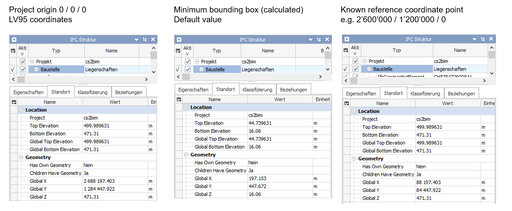
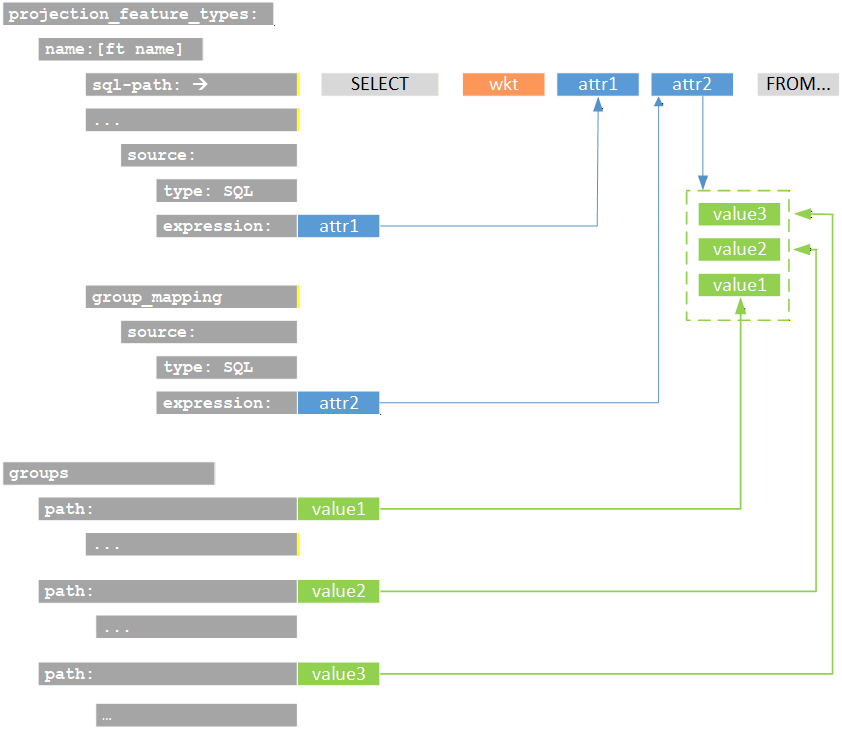
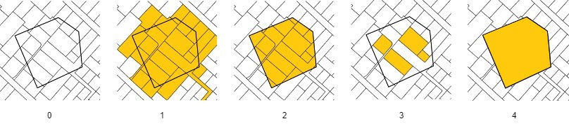

# Configuration Overview

The application is configured using a YAML file. Below, you'll find an overview of the main configuration concepts. You
can find the full and more technical documentation of the configuration file [here](./configuration_schema.md).
  

The configuration is divided into several sections:
- **Logging**: Set the application's log level (e.g., DEBUG, INFO).
- **Connections**: Provide connection settings for Redis and Database access.
- **Internationalization (i18n)**: Specify translation files to support multiple languages.
- **External Data (STAC, TIN)**: Configure where the application remote data sources (STAC APIs) can be found.
- **IFC Export**: Define how data will be structured and exported to IFC.
  
The concepts and principles of the configuration and the most important parameters are described in the following sections.

## Internationalization Support

The configuration supports referencing translation files for multiple languages. The values affected by translation are
fixed and not configurable:

- Attribute values
- Property set names
- Property names
- Property values
- Group names

If a translation key cannot be found, the original value is written unchanged. The following characters are allowed for
keys in the table: letters (lowercase), numbers and underscore (_).

Keys derived from dynamic values are generated as follows:

1. key = lower_case(key)
2. key = remove_special_characters_except_spaces(key)
3. key = trim_leading_and_trailing_spaces(key)
4. key = replace_sequences_of_spaces_with_single_underscore(key)

Example: "Year ( 1990 )" → "year ( 1990 )" → "year 1990 " → "year 1990" → "year_1990"

## External Data

The projection feature types require a DTM file source provided via a STAC API. The building feature types require a
CityGML file source.
These URLs must be defined in the STAC configuration.

### DTM

Needs to be set if there are projection feature types configured.
Expected asset properties:

- type = application/x.ascii-xyz+zip
- eo:gsd / gsd = config.tin.grid_size

### Buildings

Needs to be set if there are building feature types configured.
Expected asset properties:

- type = application/x.gml+zip

## IFC Export

### Geo referencing

You can provide the so-called "Level of Georeferencing" (LoGeoRef), according to (Clemen&Görne, 2019) [^LoGeoRef].  
The different levels represent different methods of defining information about georeferencing in IFC.  
Supported values are:

- LO_GEO_REF_30
    - IfcObjectPlacement of an IfcSpatialStructureElement contains georeferencing
    - Suitability for local projects on a smaller scale
    - IFC 2.3
- LO_GEO_REF_40
    - IfcGeometricRepresentation context of IfcProject contains georeferencing
    - Suited for larger infrastructure projects
    - IFC 2.3
- LO_GEO_REF_50
    - IfcMapConversion defines georeferencing of the "SurveyPoint", including coordinate system parameters
    - Suited for large-scale and linear project expansions
    - IFC 4.0

**Coordinates and Offsets**  
You can provide a project origin in LV95 coordinates (Easting, Northing, Height). The project origin can also be set
to (0,0,0).  
If not provided, the system sets a project origin in the lower left corner on a minimum bounding box of the perimeter.

### Feature types

A "feature type" is the definition of a set of objects that are exported as instances of an IFC entity with common definitions.
Each feature type is defined through a configuration that describes how data from the GIS database is transformed into
IFC instances. For every configured feature type, a set of instances is created. Currently, three different kinds of
feature types are supported. They differ according to the type of geometry conversion.

- **Projection**  
Projections are feature types that generate IFC structures by projecting 2D areas onto a 3D surface (in this case
the terrain model).

- **Building**  
Buildings are feature types that are generated by transforming 3D building geometries from CityGML into IFC
structures.

- **Extrusion**  
Extrusions are feature types that are generated by extruding 2D areas along a polyline. Five different cross-section
types (CIRCLE, EGG, RECTANGLE, POLYGON_GLOBAL, POLYGON_LOCAL) and three different extrusion types (POLYLINE (horizontal)
, SURFACE (vertical) and POINT (vertical)) are supported.

### SQL

The basis of a feature type is a SQL statement, that selects data from a geodata source. The SQL statement is stored in a separate file. It is executed at the beginning of constructing of the feature type instances. It determines what objects to create for the feature type. The input parameter "%(polygon)s" is the
input WKT string of the application. It is expected that this input parameter is used to select the relevant feature type instances for the request. Each result row is converted into an IFC instance. The required return columns differ from feature type to feature type.

- Projection: Expects a column with the name **wkt**[2d_wkt_polygon] that represents the area to be projected.
- Building: Expects a column with the name **egid**[number] that contains the egid number to identify the
  building.
- Extrusion: Extrusions are a bit more complicated because there are different cross-sections and extrusion types that
  require different columns. The columns **cross_section**  [[cross_section_type](../src/core/ifc/model/extrusion/cross_section_type.py)] and **extrusion_type**
  [[extrusion_type](../src/core/ifc/model/extrusion/extrusion_type.py)] are always mandatory and used to identify the
  cross-section and extrusion type. The following
  table shows the valid values for these columns and the additional required columns for each valid combination.

  | extrusion_type | cross_section_type | polyline[3d_wkt_line_string] | start_point[3d_wkt_point], end_point[3d_wkt_point] | width[number in meters] | height[number in meters] | orientation[number degrees] | area[2d_wkt_polygon] |
  |:--------------:|:------------------:|:----------------------------:|:--------------------------------------------------:|:-----------------------:|:------------------------:|:---------------------------:|:--------------------:|
  |    POLYLINE    |    CIRCLE, EGG     |              x               |                                                    |            x            |                          |                             |                      |
  |    POLYLINE    |     RECTANGLE      |              x               |                                                    |            x            |            x             |                             |                      |
  |    POLYLINE    |   POLYGON_LOCAL    |              x               |                                                    |                         |                          |                             |   x(1)    |
  |     POINT      |       CIRCLE       |                              |                         x                          |            x            |                          |                             |                      |
  |     POINT      |     RECTANGLE      |                              |                         x                          |            x            |            x             |                             |                      |
  |     POINT      |   POLYGON_LOCAL    |                              |                         x                          |                         |                          |              x              |   x(1)    |
  |    SURFACE     |   POLYGON_GLOBAL   |                              |                         x                          |                         |                          |              x              |   x(2)    |

  x(1): Polygon defined in local coordinates.

  x(2): Polygon defined in global coordinates.

  
Additional columns can be included to provide values that can be referenced in the attribute, property, or group
configurations. The following figure shows schematically the attributes of the sql statement and their referene as parameters in the configuration.    
{fig-align="left" width=75%}

  
Selecting the data by SQL is flexible and can be done in various ways. Specifically use geometry functions (e.g. intersections) and aggregation functions.  There are some examples in the sql folder.

1. The input polygon
2. All areas that intersect with the polygon are
   included ([Parcels](../examples/sql/parcels.sql), [Land covers](../examples/sql/land_covers.sql), [Land covers buildings](../examples/sql/land_covers_buildings.sql))
3. All areas are cut off at the border of the
   polygon ([Parcels intersection](../examples/sql/parcels_intersection.sql), [Land covers intersection](../examples/sql/land_covers_intersection.sql))
4. All areas that are fully contained by the polygon are
   included ([Parcels contains](../examples/sql/parcels_contains.sql), [Land covers contains](../examples/sql/land_covers_contains.sql))
5. The entire area of the input polygon without subdivisions ([Polygon](../examples/sql/polygon.sql))

**Useful postgis functions**

**ST_GeomFromText**: Constructs a PostGIS ST_Geometry object \
**ST_AsText**: Returns the OGC WKT representation of the geometry\
**ST_CurveToLine**: Converts a given geometry to a linear geometry\
**ST_Intersects**: Returns true if two geometries intersect. Geometries intersect if they have any point in common.
**ST_Contains**: Returns true if the first geometry contains the second.

Hint: The wildcard character '%' needs to be escaped like this '%%'.

### Entity Mapping

Specifies the IFC entity used to create instances for feature types. The configuration expects a string containing the
exact name of the entity as defined in the IFC schema.

Not all entities are supported by all IFC versions, so only entities that are available across the supported versions
should be used. An exception to this rule applies to IfcBuiltSystem / IfcBuildingSystem. If either of these entities is
configured, the system will automatically create the appropriate entity for the selected IFC version.

Incorrect or unsupported entity names will result in errors. The responsibility for providing a valid and compatible
entity name lies with the user.

### Attributes, properties, and group mappings

In most cases, the mapping of attributes, properties, and group mappings is defined using two values: `source` and
`expression`. It is important that the expression matches the type of source being used. An SQL source expects a column
name to retrieve a value from the SQL result set. A CityGML source expects an XPath expression that selects the desired
value (starting from bldg:Building). The static source does not resolve any value and therefore has no requirements for
the expression.
Attributes cannot be freely selected and depend on the ifc entity that is selected. If a configured attribute does not
exist, it is ignored.
Properties that are configured but not found as output column in the sql result are also ignored.

### Spatial Structure Mapping

Specifies the IFC spatial structure element that a created instance is linked to. Spatial structures are shared among
instances if their attribute or property values are identical — even across different feature types. As a result, the
total number of spatial structures ranges from one up to the number of feature type instances.

### Entity Type Mapping

Specifies an IFC entity type linked to each created instance. Entity types are shared among other instances of this
feature type if their attribute or property values are identical. Entity types are only supported by certain IFC
entities. The responsibility for configuring this correctly lies with the user. Configured entity types that do not
exist are ignored.
Attributes cannot be freely selected and depend on the ifc entity that is selected. If a configured attribute does not
exist, it is ignored.

### Groups

Each feature type instance can be assigned to one or more groups. This configuration is optional—if omitted, no group
assignment will be made. For every group assignment, the system creates an IFC group based on the specified group
configuration,
including its parameters such as entity and any number of attributes or properties. If no configuration exists for a
given assigned value, the system will generate a basic IFC group entity without additional attributes or properties.
When defining groups, the "." character can be used to create nested group structures.

For example, the group "Amtliche Vermessung.Bodenbedeckung.befestigt" results in the creation of three nested groups.
The feature type instances are assigned to the final group in this hierarchy.

- Amtliche Vermessung
    - Bodenbedeckung
        - befestigt
            - Feature type instance 1
            - Feature type instance 2
            - Feature type instance 3
            - ...