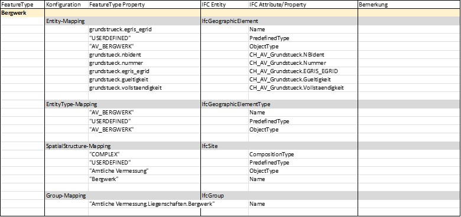
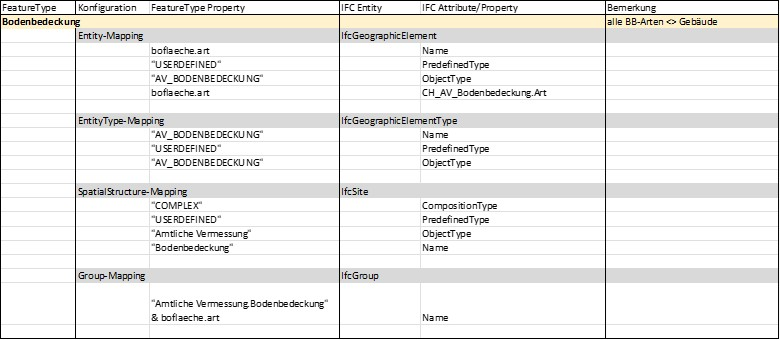
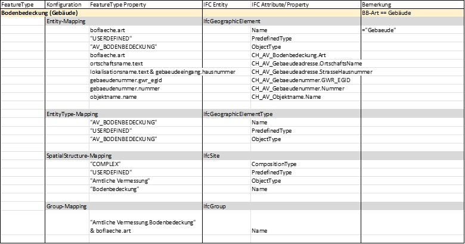
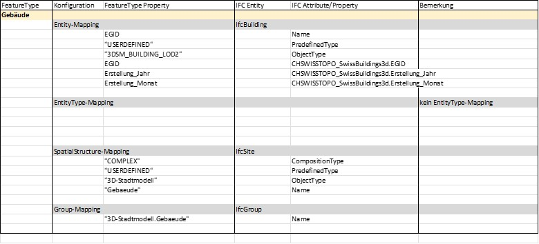

# Mapping Conventions

[This section is available only in German]  
<br>

## Einleitung
###	Ausgangslage
Die Kernfunktion von cs2bim ist die Transformation von Geodaten nach IFC. Für diese Transformation müssen Geodaten aus ihrem jeweiligen Geodatenmodell ins Datenmodell von IFC überführt werden. Dazu sind verschiedene Mappings von Klassen auf IFC-Entitys sowie zwischen Attributen notwendig. Das Datenmodell von IFC lässt auf Grund seiner generischen Erweiterungsmechanismen häufig verschiedene Mappings zu (siehe Grundlagen [hier](concepts.md#ifc-basic-principles)).  
Um die mit den Geodatenmodellen erreichte Standardisierung der Geodaten mit der Transformation nach IFC nicht zu verlieren, ist es notwendig - quasi als Ergänzung zum Geodatenmodell - auch die Transformationsregeln zur Überführung nach IFC festzulegen. Als Teil der nationalen Geodateninfrastruktur möchte Geodienste.ch die IFC-Mappings der publizierten Geodaten systematisch definieren und als Standard resp. Best Practice bereitstellen.

###	Zweck des Kapitels
Das vorliegende Kapitel beschreibt die Methodik und Prinzipien sowie die im Projekt cs2bim gemachten Abwägungen zum Mapping der Geodaten nach IFC.  
Es dient als Grundlage für die Diskussion von weiteren Mapping-Entscheiden sowie als Ergebnisdokumentation.  

Das Kapitel richtet sich an Fachpersonen aus dem Bereich Geoinformation und BIM mit einem Grundverständnis von IFC.  

Das Kapitel setzt das Grundlagenwissen zu [IFC](concepts.md#ifc-basic-principles) sowie den [Prinzipien des Mappings](mapping_principles.md) voraus. Darauf basierend sind die konkreten Mapping-Regeln für die im Projekt cs2bim behandelten Geodatensätze dokumentiert.
  

## Konventionen
Das Datenmodell von IFC ist sehr umfassend und bietet zudem auch so genannte Erweiterungsmechanismen, die für nationale oder regionale Bedürfnisse Konkretisierungen des Datenmodells erlauben. Für eine einheitliche Anwendung des Datenmodells bedingt dies die Festlegung von Prinzipien und Konventionen, die festlegen, welche Teile von IFC und wie die Erweiterungsmechanismen genutzt werden sollen.
In den nachfolgenden Kapiteln werden einige Prinzipien und Konventionen für das Mapping diskutiert und festgelegt.
  

###	Entity-Mapping
Beim Mapping eines GIS Featuretyps auf eine IFC-Entity sollte eine möglichst präzise semantische Abbildung erfolgen. Dazu sind einerseits die in IFC definierten Entitys möglichst genau zu wählen und andererseits auch der Erweiterungsmechanismus mit den so genannten PredefindedTypes zu nutzen. In IFC enthalten die Definitionen der PredefinedTypes bereits eine Aufzählung von semantisch spezielleren Ausprägungen einer Entity. Diese vordefinierten Aufzählungen können auch durch benutzerdefinierte Werte ergänzt werden. Beim Mapping ist daher zu prüfen, ob ein vordefinierter PredefinedType bereits semantisch genügend präzise ist oder ob eine spezifische Erweiterung zu definieren ist. 

Im Kontext von cs2bim und somit der Geobasisdaten bietet das Datenmodell von IFC keine grosse Auswahl an semantisch präzisen Entitys, da IFC primär Bauwerke und Bauprozesse beschreibt und administrativ-planerische Geodaten nicht im Fokus stehen. Aus der Literatur (z.B. [@atazadeh2021IntegrationCadastralSurvey]) sowie den bisherigen Best Practices kommen typischerweise folgende Entitys zur Abbildung von Geobasisdaten in Frage.

|IFC Entity|Erwägungen|
|:---|:------------|
|IfcGeographicElement|"An IfcGeographicElement is a generalization of all elements within a geographical landscape. It includes occurrences of typical geographical elements, often referred to as features, such as trees or terrain." [@buildingsmartinternational2023IFC4320DocumentationOfficial]|
|IfcSite|"A site is a defined area of land, possibly covered with water, on which the project construction is to be completed. A site may be used to erect, retrofit or turn down building(s), or for other construction related developments." [@buildingsmartinternational2023IFC4320DocumentationOfficial]|
|IfcSpatialZone|"A spatial zone is a non-hierarchical and potentially overlapping decomposition of the project under some functional consideration. A spatial zone might be used to represent a thermal zone, a construction zone, a lighting zone, a usable area zone. A spatial zone might have its independent placement and shape representation." [@buildingsmartinternational2023IFC4320DocumentationOfficial]|
|IfcAnnotation|"An annotation is an information element within the geometric (and spatial) context of a project, that adds a note or meaning to the objects which constitutes the project model. Annotations include additional points, curves, text, dimensioning, hatching and other forms of graphical notes. It also includes virtual or symbolic representations of additional model components, not representing products or spatial structures, such as survey points and lines, contour lines or similar." [@buildingsmartinternational2023IFC4320DocumentationOfficial]|
: Typische Entity-Mapping-Kandidaten für Geodaten {#tbl-entity-mapping-candidates}


###	EntityType-Mapping (Typisierung)
Jedes erzeugte Element erhält eine klare Typzuweisung. 

Für die Typnamen gilt folgende Namenskonvention:  

Typname = `Thema`\_`Klasse`  

- `Thema`: Kürzel des Themas (z.B. das Geodatenmodell oder der Themenbereich), gemäss nachfolgender Tabelle.  
- `Klasse`: Name der Klasse aus Geodatenmodell. In Ausnahmefällen kann auch der Name der Topic verwendet werden.  
  
| Thema                 | de | fr | it |
| :------------------------ |:------ | :----- | :----- |
| Amtliche Vermessung       | AV     | MO     | MU     |
| 3D-Gebäude (Stadtmodell)  | 3DSM   | 3D??   | 3D??   |
| Leitungskataster          | LK     |        |        |
| Naturgefahrenhinweiskarte | NGH    |        |        |
| …                         |        |        |        |
: Themen-Kürzel {#tbl-topic-abbreviations}
  

Schreibweise: Typnamen in GROSSBUCHSTABEN, Leerschläge durch Tiefstriche "\_" ersetzt.  
Typnamen sind damit bewusst eher "technisch" geschrieben (im Gegensatz zu Gruppierungen, die "normal", umgangssprachlicher geschrieben sind).
  
Beispiele von Typnamen:  

| de                | fr                   | it                     |
|:----------------- |:-------------------- |:---------------------- |
| AV_LIEGENSCHAFT   | MO_BIEN_FONDS        | MU_BENE_IMMOBILE       |
| AV_SELBSTRECHT    | MO_DDP               | MU_DPSSP               |
| AV_BERGWERK       | MO_MINE              | MU_MINIERA             |
| AV_BODENBEDECKUNG | MO_COUVERTURE_DU_SOL | MU_COPERTURA_DEL_SUOLO |
|                   |                      |                        |
: Beispiele Typnamen {#tbl-typename-examples}

  
Die Typzuweisung zu einem Element erfolgt zweifach mit beiden von IFC vorgesehenen Typisierungskonzepten:  

- Attribut ObjectType: Der Typname wird im Attribut ObjectTyp gesetzt.  
- Verweis auf Objekttyp-Instanz: Für jeden Typ wird eine Typinstanz angelegt (IfcElementType) und die entsprechenden Elemente verweisen auf die Typinstanz.  


###	Spatial Structure Mapping
Die Raumstrukturierung von IFC (IfcSpatialStructureElement) wird für eine rein thematische Gruppierung verwendet.   
Es wird dazu für jeden EntityType eine eigene Raumstruktur-Instanz (IfcSite) gebildet.   
Es wird keine thematische Hierarchisierung gemacht, d.h. alle Raumstruktur-Instanzen liegen in einer "flachen" Auflistung vor (im Gegensatz zu den ebenfalls unterstützen IFC-Gruppen, siehe Group-Mapping in Kapitel 3.4).
  
Anmerkung: Die in IFC eigentlich vorgesehene raum-logische Struktur wird für die Geobasisdaten nicht angestrebt. Dies ist darin begründet, dass einerseits eine raum-logische Strukturierung im Sinne von IFC für Geobasisdaten nur bedingt sinnvoll ist und andererseits aber viele BIM-Viewer die Raumstruktur als primäre Objektstruktur bereitstellen und somit die "typischen BIM-Benutzenden" diese Navigation gewohnt sind (--> Unterstützung Benutzendenakzeptanz).


###	Group-Mapping
Die Gruppierungsstrukturen von IFC werden genutzt, um die thematische Gliederung der Geodatensätze abzubilden. Dabei können auch beliebig tiefe Hierarchien gebildet werden, falls dies fachlich-thematisch sinnvoll ist.  
Die Gruppennamen werden dabei möglichst sprechend und selbsterklärend gewählt und können daher (leicht) von den Namen der Raumstruktur und Typendefinitionen abweichen.
  
Für cs2bim wird in der ersten Version folgende thematische Gliederung definiert:
```
Amtliche Vermessung  
    Liegenschaften  
        Liegenschaft  
        SelbstRecht  
        Bergwerk  
    Bodenbedeckung  
3D-Stadtmodell  
```

Die Gruppierungs-Struktur ist somit sehr ähnlich zur gewählten Raumstrukturierung (IfcSpatial-StructureElement), mit dem Unterschied, dass die Gruppierungs-Struktur eine tiefere Hierarchiestruktur abbildet.


###	Property-Mapping
Das Konzept der Propertys ist ein zentraler Erweiterungsmechanismus von IFC. Es erlaubt die Definition beliebiger Eigenschaften (Property) für jede IFC-Entity. Mit dem Standard IFC sind aber auch eine grosse Anzahl an Propertys vordefiniert, die eine klar definierte Semantik haben. 
Mit dem Ziel eines harmonisierten, standardisierten Datenaustausch ist es sehr wichtig, einheitlich definierte Propertys zu verwenden und nach Möglichkeit primär auch die bereits mit IFC vordefinierten Propertys zu nutzen.  
  
Die Propertys (und auch die PropertySets) können frei benannt werden (mit Ausnahme des Präfix "Pset_", welcher für buildingSmart reserviert ist). Als Namenskonvention für die spezifisch definierten Propertys im Rahmen von cs2bim werden folgende Regeln definiert. 

#### PropertySets
PropertySet-Name = `Präfix`\_`Thema`\_`Klasse`  

- `Präfix` = CH`Org-Kurzzeichen`  
  Nationale Kennung "CH" sowie Kurzzeichen Organisation.  
- `Org-Kurzzeichen`:  
  Kurzzeichen der verantwortlichen Organisation, z.B. Kantonskürzel.  
  Für nationale Geodatensätze wird das Org-Kurzzeichen weggelassen.  
- `Thema`:  
  Kürzel des Themas (z.B. das Geodatenmodell oder der Themenbereich), siehe Definition bei EntityTypes in Kapitel 3.2.  
- `Klasse`:  
  Name der Klasse oder aus Geodatenmodell. In Ausnahmefällen kann auch der Name der Topic verwendet werden, sofern die eindeutige Rückverfolgbarkeit der Propertys auf die Klasse gewährleistet ist.  
  
Die PropertySets sind sprachspezifisch in den Sprachen der MGDMs definiert. D.h. wenn ein MGDM in mehreren Sprachen vorliegt, werden entsprechend auch die PropertySets in diesen Sprachen geführt.  
  
Beispiele:  

- CH_AV_Grundstueck
- CH_AV_Bodenbedeckung
- CH_MO_GenreImmeuble
- CH_MO_CouvertureDuSol
- CHSWISSTOPO_SwissBuildings3d
- CHLU_3DSM

Schreibweise PSet-Namen: Präfix und Thema in Grossbuchstaben, Klasse in Kamelschreibweise.

#### Property
Property-Name = Nach Möglichkeit identisch zum Attributnamen des entsprechenden Geodatenmodells in der entsprechenden Sprache.  

Die PropertySets sind sprachspezifisch in den Sprachen der MGDMs definiert.  

Schreibweise: Identisch zur Schreibweise im Geodatenmodell (INTERLIS).  


## Umgang mit Redundanz
Mit den gewählten Mapping-Definitionen werden im erzeugten IFC-Datensatz bewusst redundante Informationen erzeugt (z.B. thematische Gruppierung und Typdefinitionen, thematische Grup-pierung und Raumstrukturierung, Typdefinition auf der Instanz sowie auch auf der zugewiesenen Typinstanz).  
Die Redundanzen sollen helfen, möglichst viele unterschiedliche Nutzungsweisen und Softwareanwendungen zu unterstützen. Die erzeugten IFC-Dateien werden als nicht weiter bearbeitbare Referenzinformationen genutzt, so dass keine Inkonsistenzen zu erwarten sind.


## Mappings konkreter Geodatensätze
Im Folgenden sind die in cs2bim konkret festgelegten Spezifikationen der Mapping-Regeln dokumentiert (für die Sprache Deutsch).  

Konventionen (der Dokumentation):
- Konstante Werte in "Anführungszeichen"
- Dynamisch aus den Daten abgeleitete Werte in normaler Schreibweise mit objektorientierter Notation, z.B. grundstueck.nbident (Wert der Tabelle grundstueck, Attribut nbident).

###	Liegenschaften
Quelldaten:  

- DM01AVCH24LV95D.Liegenschaften.Liegenschaft / .SelbstRecht / .Bergwerk  
- DM01AVCH24LV95D.Liegenschaften.Grundstueck  

{#fig-mapping-configuration-liegenschaft}


{#fig-mapping-configuration-selbstrecht}


{#fig-mapping-configuration-bergwerk}


###	Bodenbedeckung
Quelldaten:  

- DM01AVCH24LV95D.Bodenbedeckung.BoFlaeche  
 
{#fig-mapping-configuration-bodenbedeckung-alle}


{#fig-mapping-configuration-bodenbedeckung-gebaeude}


###	3D-Gebäude
Quelldaten:   

- SwissBuildings3d, Version 3  

{#fig-mapping-configuration-swissbuildings3d}


