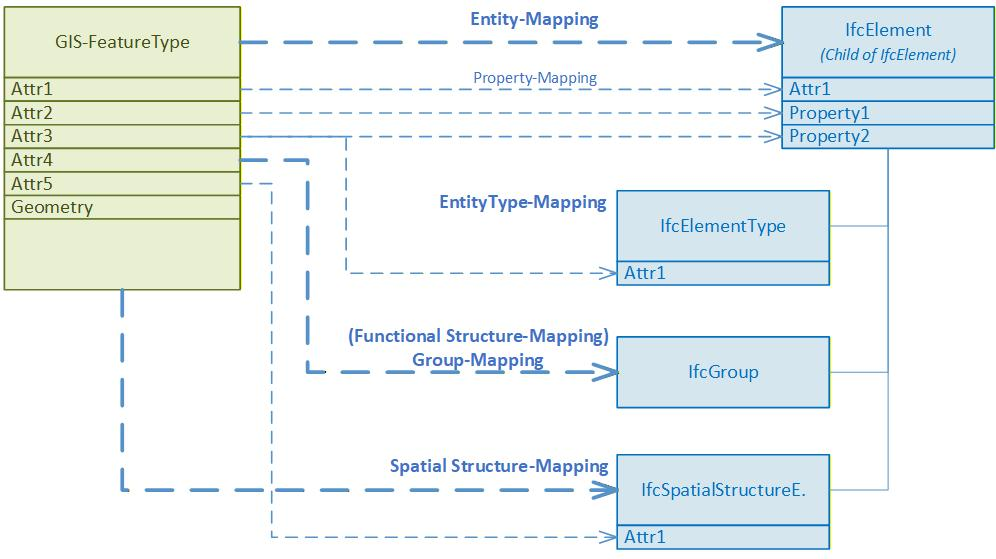
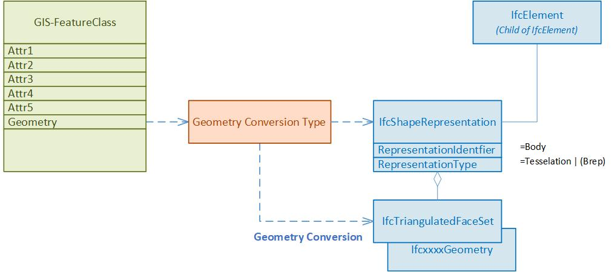

# Mapping Principles

To convert a typical geodataset to IFC, both semantic mappings and geometric conversions must be defined, see figure below.  

![Mapping Principles Overview ([@schildknecht2025IntegrationLandAdministration])](../uploads/mapping-principle-overview.jpg){#fig-mapping-principles-overview}

In [@schildknecht2025IntegrationLandAdministration], the various semantic and geometric mappings are described and discussed in detail.  

The semantic mapping implemented with cs2bim comprises five mapping levels (see also figure below):

- Entity mapping
- Property mapping
- EntityType mapping
- Spatial structure mapping
- Group mapping

{#fig-mapping-principles-entity fig-align="left" width=75%}

The figure above schematically illustrates how transformation functions can be defined from the geodatabase (GIS feature type) based on class or attribute rules for the various mapping levels.  

| Mapping  level            |  Description             |
| :-------------------------|:----------------------------------------------------------------------------|
| Entity mapping            | Entity mapping specifies which IFC entities (child elements of `IfcElement`) are instantiated from which instances of the geodatabase.|
| Property mapping          | Property mapping determines which attributes of the geodata instance are transferred as properties of the IFC instance. In IFC, these properties can be defined either as IFC attributes or as properties (using PropertySets).|
| EntityType mapping        | The EntityType mapping specifies which type instance (IfcElementType) the generated IFC instance is assigned to (see the IFC typification concept). The type instances used are also derived from the geodata instance, for example by assigning attribute values to the type instance.   |
| Spatial structure  mapping | Spatial structure mapping determines which spatial structure (IfcSpatialStructureElement) the generated IFC instance is assigned to. The spatial structure instances used are also derived from the geodata instance, for example by assigning attribute values to the spatial structure instance. |
| Group mapping             | Group mapping determines which group (IfcGroup) the generated IFC instance is assigned to. The group instances used are also derived from the geodata instance. |
: Mapping levels {#tbl-mapping-levels}

 
 
The geometric conversion is shown schematically in the figure below. Based on the defined conversion type, an IFC geometry is generated from the geometry of the geodata instance and assigned to the generated IFC instance. This process always involves at least one geometry type conversion from a WKT definition to an IFC definition. Depending on the source dataset, additional processing of the geometry may also occur — e.g., from 2D to 3D.  

{#fig-mapping-principles-geometry fig-align="left" width=75%}

This chapter focuses on semantic mapping; therefore, geometric conversion will not be discussed further here. For more information on geometric conversion, see the relevant sections in this documentation. 